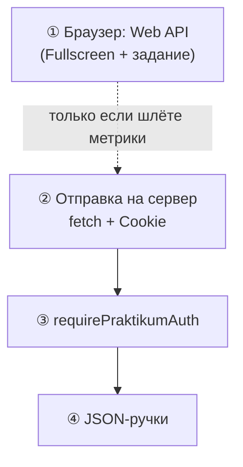

# Дополнительный Web API (кроме Fullscreen)

> **Термины:** здесь **Web API** = **браузерные** интерфейсы (Fullscreen, Performance, Geolocation…). Это **не** описание HTTP-ручек `packages/server` и **не** замена проверки сессии на Node. Как устроены **cookie**, **`requirePraktikumAuth`** и защищённые маршруты — см. **[`auth-middleware-backend.md`](./auth-middleware-backend.md)** и **[`project-structure.md`](./project-structure.md)**. Расширенный обзор браузерных API — **[`project-web-api.md`](./project-web-api.md)**.



**Смысл:** шаг **①** — локально во вкладке, без Node. Цепочка **②→③→④** нужна лишь если метрики или иные данные уходят на **`packages/server`**; тогда см. чеклист в [`auth-middleware-backend.md`](./auth-middleware-backend.md).

---

В проекте **Fullscreen API** уже обёрнут и используется:

- [`packages/client/src/utils/fullscreen.ts`](../packages/client/src/utils/fullscreen.ts) — `enterFullscreen`, `exitFullscreen`, `toggleFullscreen`, `addFullscreenChangeListener` (с учётом Safari `webkit*`).
- [`packages/client/src/components/Header/index.tsx`](../packages/client/src/components/Header/index.tsx) — кнопка полноэкранного режима на игре, подписка на `fullscreenchange` с очисткой в `useEffect`.

Задание: добавить **ещё один** API из списка. Ниже — рекомендация **Performance API** (измерение длительности кадров / навигации), с конкретными врезками под match-3.

Альтернативы из списка задания:

| API | Идея в Cosmic Match |
|-----|---------------------|
| **Geolocation** | Мало для core-loop; регион в профиле / пасхалка (нужен явный запрос). |
| **Notifications** | Конец таймера при свёрнутой вкладке (`Notification.requestPermission()`). |
| **Performance** | FPS, длительность партии, `longtask` — отчёт и отладка. |

Документация MDN: [Performance API](https://developer.mozilla.org/en-US/docs/Web/API/Performance).

---

## 1. Врезка: утилита замеров

Новый файл `packages/client/src/utils/performanceMetrics.ts`:

```ts
const marks = {
  match3SessionStart: 'match3:session:start',
  match3SessionEnd: 'match3:session:end',
} as const

export function markMatch3SessionStart() {
  if (
    typeof performance === 'undefined' ||
    typeof performance.mark !== 'function'
  ) {
    return
  }
  try {
    performance.mark(marks.match3SessionStart)
  } catch {
    /* ignore */
  }
}

export function measureMatch3SessionEnd(): number | null {
  if (
    typeof performance === 'undefined' ||
    typeof performance.mark !== 'function' ||
    typeof performance.measure !== 'function'
  ) {
    return null
  }
  try {
    performance.mark(marks.match3SessionEnd)
    performance.measure(
      'match3-session',
      marks.match3SessionStart,
      marks.match3SessionEnd
    )
    const entries =
      performance.getEntriesByName('match3-session')
    const last = entries[entries.length - 1]
    performance.clearMarks(marks.match3SessionStart)
    performance.clearMarks(marks.match3SessionEnd)
    performance.clearMeasures('match3-session')
    return last?.duration ?? null
  } catch {
    return null
  }
}
```

---

## 2. Врезка: вызов из игры

В **`packages/client/src/pages/GamePage.tsx`** (или в `Match3Screen.tsx`, где стартует партия):

1. При входе на игровой экран / старте сессии — **`markMatch3SessionStart()`**.
2. В обработчике завершения партии (рядом с `LAST_RESULT_KEY` и навигацией) — **`measureMatch3SessionEnd()`**; при желании записать длительность в `sessionStorage` или в поле `data` лидерборда.

Пример (псевдокод места):

```ts
import {
  markMatch3SessionStart,
  measureMatch3SessionEnd,
} from '../utils/performanceMetrics'

markMatch3SessionStart()

const sessionMs = measureMatch3SessionEnd()
if (sessionMs != null) {
  console.debug(
    '[Performance] match3 session ms:',
    sessionMs
  )
}
```

Точное место — по **`onGameEnd`** в `GamePage.tsx` / `Match3Screen.tsx`.

Если позже **отправляете** метрики на **`packages/server`**, заведите отдельную ручку и **обязательно** повесьте на неё **`requirePraktikumAuth`** (см. [`auth-middleware-backend.md`](./auth-middleware-backend.md)).

---

## 3. Опционально: PerformanceObserver (long tasks)

```ts
export function observeLongTasks(
  onLong: (duration: number) => void
) {
  if (
    typeof PerformanceObserver === 'undefined'
  ) {
    return () => {}
  }
  try {
    const obs = new PerformanceObserver(list => {
      for (const e of list.getEntries()) {
        if (e.duration > 50)
          onLong(e.duration)
      }
    })
    obs.observe({
      type: 'longtask',
      buffered: true,
    })
    return () => obs.disconnect()
  } catch {
    return () => {}
  }
}
```

В `GamePage` — `useEffect` с отпиской **`disconnect`** при размонтировании (см. `MEMORYLEAKS.md`).

---

## 4. Критерий готовности

- Пользовательски заметная фича на базе выбранного API (не только `console.log`).
- Нет утечек: слушатели / observer отключаются при размонтировании.
- Краткий комментарий в коде или в PR: зачем API и где смотреть результат.
- Понимание границы: **Web API в браузере** ≠ **авторизация на бэкенде**; при появлении своих HTTP-ручек — см. [`auth-middleware-backend.md`](./auth-middleware-backend.md).
