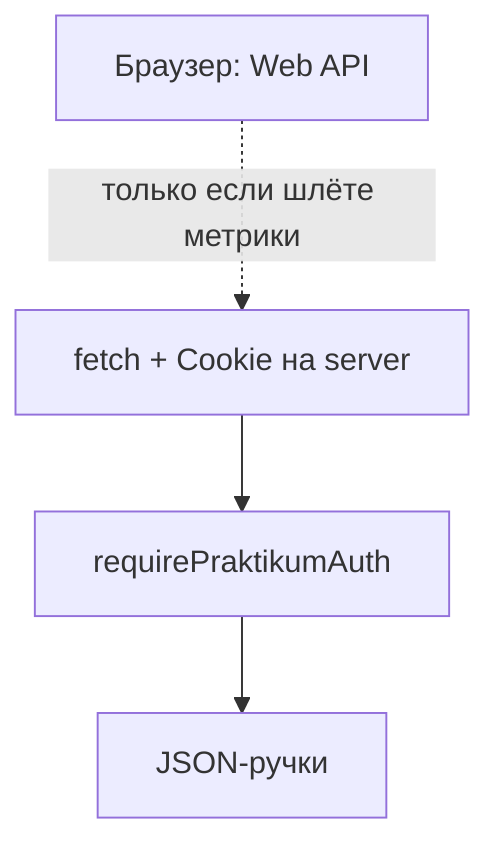

# Дополнительный Web API

> **Web API** здесь — браузерные API (Fullscreen, Performance, Page Visibility…), не HTTP-ручки `packages/server`. Cookie и `requirePraktikumAuth` — в [auth-middleware-backend.md](./auth-middleware-backend.md). Обзор по проекту — [project-web-api.md](./project-web-api.md).

Шаг в браузере не требует Node. Цепочка справа нужна только если данные уходят на наш API.

---

## Уже сделано (не повторять в 9.3)

| Спринт | API | Где |
|--------|-----|-----|
| 6.6 | **Fullscreen** | [fullscreen.ts](../packages/client/src/utils/fullscreen.ts), [Header](../packages/client/src/components/Header/index.tsx), `GamePage` (клавиша F) |
| 7.5 | **Performance** (`mark` / `measure`, `PerformanceObserver` longtask) | [performanceMetrics.ts](../packages/client/src/utils/performanceMetrics.ts), [GamePage.tsx](../packages/client/src/pages/GamePage.tsx), [Match3Screen.tsx](../packages/client/src/game/match3/Match3Screen.tsx) |
| — | **localStorage / sessionStorage** | настройки, результат партии, темы, форум-редирект |
| — | **Speech Synthesis** (озвучка иероглифов) | [HieroglyphCardOverlay.tsx](../packages/client/src/game/match3/HieroglyphCardOverlay.tsx) — отдельное задание не закрывало; для 9.3 лучше не брать |

`visibilitychange` уже слушает **только** мониторинг Performance (пауза longtask), **не** останавливает таймер партии. Это не засчитывается как фича Page Visibility для игрока.

---

## Задача 9.3 (спринт 9): что делать

**Рекомендация: [Page Visibility API](https://developer.mozilla.org/en-US/docs/Web/API/Page_Visibility_API)**

Почему сейчас:

- Прямая польза в match-3: честная пауза, когда вкладка в фоне.
- Ложится на уже есть overlay «Пауза» в `Match3Screen`.
- Не дублирует Fullscreen (6.6) и Performance (7.5).
- Мало правок, заметно на демо.

**Запасные варианты** (если Visibility не зайдёт):

| API | Сценарий | Сложность |
|-----|----------|-----------|
| **Notification** | Напоминание «вернись в игру» после opt-in; только при `granted` | средняя, нужен toggle в UI |
| **Vibration** | Короткий отклик на крупный комбо / победу; toggle «вибрация» | низкая, только mobile |
| **Clipboard** | «Скопировать счёт» на экране финиша | низкая |
| **Geolocation** | Регион в профиле | высокая, privacy, для нас слабый приоритет |

**Не брать для 9.3:** Performance (7.5), Fullscreen (6.6), снова только `console.log` без UI.

---

## План: Page Visibility (9.3)

### 1. Утилита

Файл `packages/client/src/utils/pageVisibility.ts`:

- `subscribePageVisibility(onChange: (hidden: boolean) => void): () => void`
- guards: `typeof document === 'undefined'`, нет API → no-op unsubscribe
- слушатель: `document.visibilityState` / `visibilitychange`
- при подписке сразу вызвать `onChange(document.visibilityState === 'hidden')`

### 2. Игра

В [Match3Screen.tsx](../packages/client/src/game/match3/Match3Screen.tsx) (или тонкий хук `usePageVisibilityPause`):

1. При `hidden === true` и фаза `playing` — открыть тот же пауза-overlay, что по кнопке (или отдельный текст: «Вкладка в фоне — игра на паузе»).
2. При возврате на вкладку — **не** снимать паузу автоматически (игрок сам жмёт «Продолжить»), либо снять только если пауза была из-за visibility — зафиксировать в PR.
3. Диспатчить существующий `MATCH3_PERF_PAUSE_EVENT` с `{ paused: true }`, чтобы 7.5 не считал long tasks в фоне (уже согласовано с [performanceMetrics.ts](../packages/client/src/utils/performanceMetrics.ts)).

### 3. UI

- Бейдж или строка в overlay паузы при `document.hidden`.
- Опционально: пункт в настройках игры «Пауза при сворачивании вкладки» (localStorage, по умолчанию `true`).

### 4. Тесты

- Unit: mock `document.visibilityState`, проверить вызов callback и `removeEventListener` после unsubscribe.
- Ручная проверка: `/game/play` → старт → свернуть вкладку → таймер/ходы не идут → вернуться → overlay виден.

### 5. Критерий готовности (9.3)

- [ ] Отдельный util + подписка с cleanup в `useEffect`
- [ ] Поведение видно игроку (не только консоль)
- [ ] Fallback, если API нет
- [ ] Строка в PR / комментарий: зачем API
- [ ] Обновить [s9-plan.md](./s9-plan.md) или README: 9.3 → Page Visibility

---

## Альтернатива: Notification API

Если команда выберет уведомления вместо Visibility.

1. Toggle в профиле или на `/game`: «Напоминания».
2. `Notification.requestPermission()` только по клику.
3. При `granted` — один сценарий, например после ухода со страницы игры: `setTimeout` + проверка `document.hidden`, затем `new Notification('Cosmic Match', { body: '…', tag: 'match3-remind' })`.
4. Флаг opt-in: `localStorage` `match3:notifications-opt-in`.
5. Не дублировать без разрешения; не слать в SSR.

MDN: [Notifications API](https://developer.mozilla.org/en-US/docs/Web/API/Notifications_API).

---

## Справка: Performance (7.5, уже в коде)

Реализовано в [performanceMetrics.ts](../packages/client/src/utils/performanceMetrics.ts):

- `markMatch3SessionStart` / `measureMatch3SessionEnd`
- `startPerformanceMonitoring` + longtask observer + итог в консоль
- пауза observer при overlay и при `visibilitychange` (внутренне для метрик)

Новый код 9.3 **может** вызывать `MATCH3_PERF_PAUSE_EVENT`, но не должен копировать логику замеров.

---

## Отправка метрик на server (опционально)

Если позже метрики уйдут на `packages/server`:

- отдельная ручка POST;
- обязательно `requirePraktikumAuth` — см. [auth-middleware-backend.md](./auth-middleware-backend.md).

Для зачёта 9.3 сервер не обязателен.

---

## Ссылки

- [s9-plan.md](./s9-plan.md) — задача 9.3
- [project-web-api.md](./project-web-api.md) — полный обзор и порядок API
- [MEMORYLEAKS.md](./MEMORYLEAKS.md) — cleanup слушателей и observers
