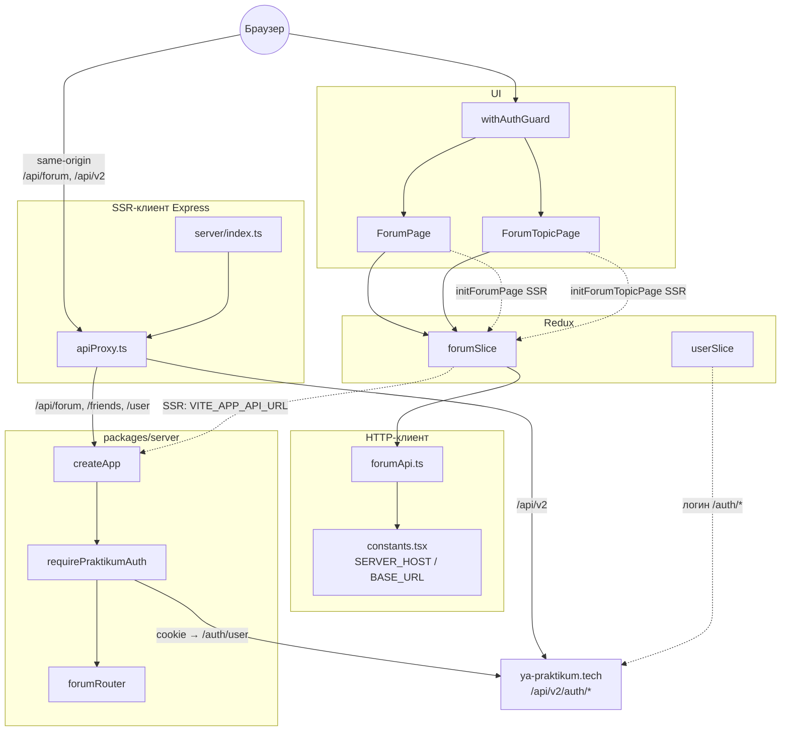
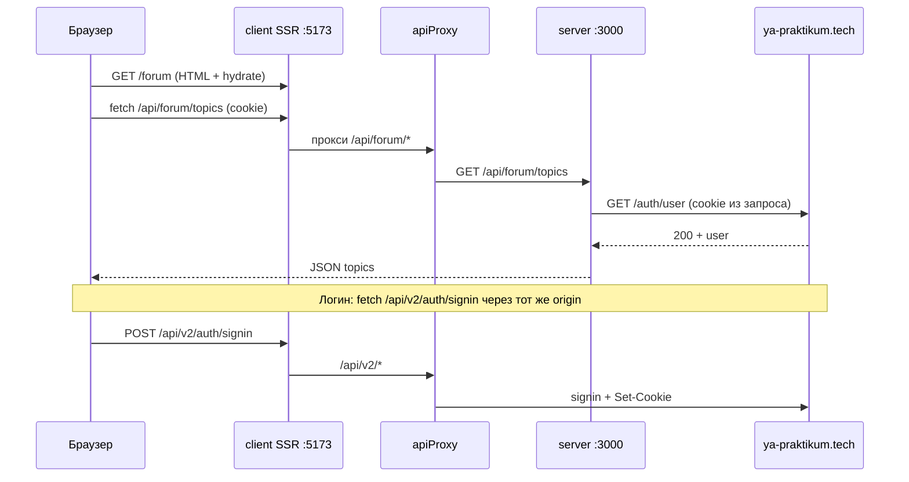
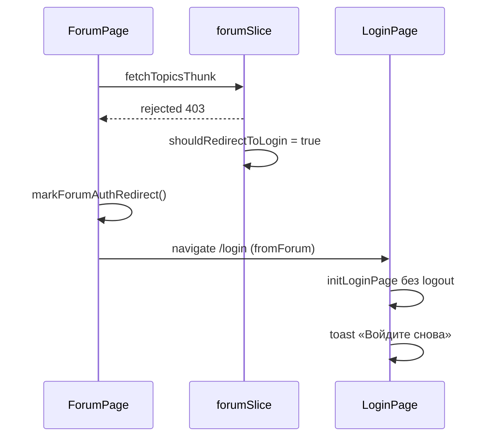

# Клиент API форума

Документ для задачи **«Подключить клиент к API форума»** (ветка `feature/8.202-forum-chores`, после merge `feature/8.2-forum-api` и `feature/8.4-auth-backend`).

Связанные материалы:

- [forum-api-spec.md](./forum-api-spec.md) — REST-контракт `/api/forum`, модели, middleware на сервере.
- [forum-server-infra.md](./forum-server-infra.md) — Docker, env, same-origin прокси `apiProxy`.
- [forum-api-prr.md](./forum-api-prr.md) — ревью серверной реализации API.

---

## 1. Цель и результат

| Требование | Решение |
|------------|---------|
| Убрать заглушки, ходить на реальный API | [`forumApi.ts`](../packages/client/src/shared/api/forumApi.ts) → `GET/POST/PATCH/DELETE` на `/api/forum/*` |
| Сессия Практикума для защищённых ручек | `credentials: 'include'`; cookie уходят на **тот же origin**, что и SSR-клиент (прокси) |
| Список топиков, создание, страница топика | [`ForumPage`](../packages/client/src/pages/ForumPage.tsx), [`ForumTopicPage`](../packages/client/src/pages/ForumTopicPage.tsx) |
| Комментарии (дерево), реакции, правки | Thunk’и в [`forumSlice.ts`](../packages/client/src/slices/forumSlice.ts), UI на `ForumTopicPage` |
| Неавторизованный пользователь | [`withAuthGuard`](../packages/client/src/hoc/withAuthGuard.tsx) + **403** → редирект на `/login` |
| Типы совпадают с API | [`types/forum.ts`](../packages/client/src/types/forum.ts) |

**Итог:** клиент полностью на Redux Toolkit + `fetch`; демо-данные в slice удалены; ошибки API нормализуются в `ForumApiError` / `ForumRejectPayload`.

---

## 2. Схема взаимодействия

### 2.1. Слои приложения



### 2.2. Запрос в браузере (dev / Docker)



Без прокси (прямой `http://localhost:3000` из браузера) cookie Практикума **не** попадают на Node API → **403** на форуме. Поэтому в браузере [`SERVER_HOST`](../packages/client/src/constants.tsx) пустой, а путь — относительный (`/api/forum/...`).

---

## 3. Ключевые файлы

### 3.1. HTTP и типы

| Файл | Назначение |
|------|------------|
| [`forumApi.ts`](../packages/client/src/shared/api/forumApi.ts) | `forumRequest`, `ForumApiError`, функции `forumGetTopics`, `forumCreateTopic`, `forumGetAllComments` (сбор страниц), реакции и т.д. |
| [`types/forum.ts`](../packages/client/src/types/forum.ts) | `ForumTopic`, `ForumComment`, `ForumReactionAgg`, payload’ы создания |
| [`constants/forumEmojis.ts`](../packages/client/src/constants/forumEmojis.ts) | Whitelist эмодзи для UI реакций (совпадает с сервером) |
| [`constants.tsx`](../packages/client/src/constants.tsx) | `SERVER_HOST` (браузер: `''`, SSR: `VITE_APP_API_URL`), `BASE_URL` (`/api/v2` в браузере) |

Базовый URL запроса форума:

```ts
// forumApi.ts — путь всегда с префиксом /api/forum
forumUrl('/api/forum/topics')  // браузер → /api/forum/topics (прокси)
```

### 3.2. Состояние (Redux)

| Файл | Назначение |
|------|------------|
| [`forumSlice.ts`](../packages/client/src/slices/forumSlice.ts) | `ForumState`, async thunk’и, селекторы |
| [`store.ts`](../packages/client/src/store.ts) | Редьюсер `forum` в общем store |

**Thunk’и:**

| Thunk | API |
|-------|-----|
| `fetchTopicsThunk` | `GET /api/forum/topics` |
| `fetchTopicByIdThunk` | топик + все комментарии (пагинация в `forumGetAllComments`) + карта реакций |
| `createTopicThunk` | `POST /api/forum/topics` |
| `createCommentThunk` | `POST .../comments` |
| `updateTopicThunk` / `deleteTopicThunk` | `PATCH` / `DELETE` топика |
| `updateCommentThunk` / `deleteCommentThunk` | `PATCH` / `DELETE` комментария |
| `toggleCommentReactionThunk` | `POST` / `DELETE` реакции + обновление агрегатов |

**Флаг `shouldRedirectToLogin`:** matcher на все `forum/*/rejected` с `payload.status === 403` → страницы делают `navigate('/login')`.

### 3.3. Страницы и роутинг

| Файл | Назначение |
|------|------------|
| [`ForumPage.tsx`](../packages/client/src/pages/ForumPage.tsx) | Список топиков, форма создания; `initForumPage` → `fetchTopicsThunk` |
| [`ForumTopicPage.tsx`](../packages/client/src/pages/ForumTopicPage.tsx) | Топик, дерево комментариев, реакции, edit/delete (автор или `viewerIsModerator`) |
| [`routes.tsx`](../packages/client/src/routes.tsx) | `/forum`, `/forum/:topicId` + `fetchData` для SSR |
| [`withAuthGuard.tsx`](../packages/client/src/hoc/withAuthGuard.tsx) | Обёртка непубличных маршрутов; до API — редирект, если нет пользователя в `userSlice` |
| [`forumAuthRedirect.ts`](../packages/client/src/shared/forumAuthRedirect.ts) | Флаг в `sessionStorage`: после 403 форума **не** вызывать `logout` на `/login` |
| [`LoginPage.tsx`](../packages/client/src/pages/LoginPage.tsx) | `initLoginPage` учитывает `consumeForumAuthRedirect()`; toast при `state.fromForum` |

Стили: [`shared/styles/forum.pcss`](../packages/client/src/shared/styles/forum.pcss).

### 3.4. SSR-прокси (инфраструктура для cookie)

| Файл | Назначение |
|------|------------|
| [`server/apiProxy.ts`](../packages/client/server/apiProxy.ts) | `/api/v2` → Практикум; `/api/forum`, `/friends`, `/user` → `INTERNAL_SERVER_URL` |
| [`server/index.ts`](../packages/client/server/index.ts) | `registerApiProxy(app)` до Vite/static |

Подробнее env и Docker — в [forum-server-infra.md](./forum-server-infra.md).

---

## 4. Потоки данных

### 4.1. Открытие списка форума

1. Пользователь заходит на `/forum` → `withAuthGuard` проверяет `userSlice`.
2. SSR: `initForumPage` → `fetchTopicsThunk` → `forumGetTopics()` (на сервере URL из `VITE_APP_API_URL`).
3. Гидратация: при необходимости повторный запрос из браузера через прокси.
4. `ForumPage` рендерит `selectTopics`, форма → `createTopicThunk`.

### 4.2. Страница топика

1. `/forum/:topicId` → `initForumTopicPage` → `fetchTopicByIdThunk(topicId)`.
2. Slice кладёт `currentTopic`, `comments`, `reactionsByCommentId`.
3. `ForumTopicPage` строит дерево по `parentCommentId` (рекурсия `renderCommentTree`).
4. Права UI: `user.id === authorPraktikumId` или `topic.viewerIsModerator` (сервер всё равно валидирует).

### 4.3. Ошибка 403 (нет сессии на API форума)



Без `forumAuthRedirect` стандартный `initLoginPage` вызывал бы `logout` → обрыв сессии Практикума и лишние **401**.

---

## 5. Конфигурация и запуск

### 5.1. Переменные (клиент)

| Переменная | Где | Зачем |
|------------|-----|--------|
| `VITE_APP_API_URL` | `.env`, Vite `define` | SSR и прямой доступ к Node API (по умолчанию `http://localhost:3000`) |
| `EXTERNAL_SERVER_URL` | `package.json` scripts `dev` | То же для dev SSR |
| `INTERNAL_SERVER_URL` | dev / Docker client | Цель прокси для `/api/forum` (`http://localhost:3000` или `http://server:3000`) |
| `PRAKTIKUM_API_URL` | Docker client | Origin Практикума для `/api/v2` |

### 5.2. Локальная проверка

```bash
# из корня репозитория
cp .env.sample .env   # при необходимости
docker compose up -d postgres
yarn db:migrate

# терминал 1
yarn workspace server dev

# терминал 2
yarn workspace client dev
```

Открывать форум: **http://localhost:5173/forum** (origin SSR-клиента с прокси), не `localhost:3000`.

### 5.3. Проверки CI / локально

```bash
yarn workspace client typecheck
yarn workspace client lint
yarn workspace client test
yarn workspace client build:ssr-server
yarn workspace server build
yarn workspace server test
```

---

## 6. Зависимости от других задач

| Компонент | Ветка / PR | Без этого |
|-----------|------------|-----------|
| REST `/api/forum` + БД | `feature/8.2-forum-api` | Нет данных, 404/500 |
| `requirePraktikumAuth`, CORS credentials | `feature/8.4-auth-backend` [#129](https://github.com/kirillchistov/42-gamedev-teamwork/pull/129) | 403 без корректной проверки cookie |
| `apiProxy`, Docker env клиента | та же ветка + [forum-server-infra.md](./forum-server-infra.md) | 403 в браузере из-за cross-origin cookie |
| Тема UI (опционально) | `feature/8.3-theme-client` [#128](https://github.com/kirillchistov/42-gamedev-teamwork/pull/128) | Только визуал landing, на API не влияет |

---

## 7. Ограничения MVP (клиент)

- **Комментарии:** `forumGetAllComments` подгружает все страницы подряд (`limit`/`offset`); кнопки «Показать ещё» / infinite scroll нет.
- **Реакции:** после toggle — повторный `GET` реакций по комментарию (не оптимистичный UI).
- **SSR при 403:** редирект на `/login` в основном срабатывает на клиенте после гидратации (`useEffect` на страницах форума).

Детали контракта и серверные лимиты — в [forum-api-spec.md](./forum-api-spec.md).
