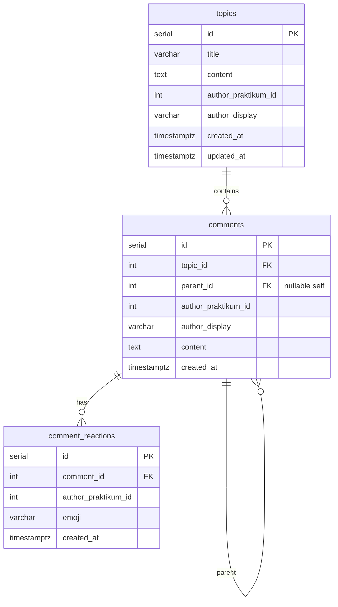

# Форум: требования API и план реализации

Текущее состояние:
['forumSlice.ts'](../packages/client/src/slices/forumSlice.ts) ходит на **`VITE_APP_API_URL`** + `/api/forum` (см. ['forumApi.ts'](../packages/client/src/shared/api/forumApi.ts)); демо-данные удалены. Типы ['forum.ts'](../packages/client/src/types/forum.ts), страницы ['ForumPage'](../packages/client/src/pages/ForumPage.tsx), ['ForumTopicPage'](../packages/client/src/pages/ForumTopicPage.tsx). Роуты '/forum', '/forum/:topicId' уже **за 'withAuthGuard'** — при отказе авторизации редирект на '/login' (['withAuthGuard.tsx'](../packages/client/src/hoc/withAuthGuard.tsx)). **403** от API форума: редирект на `/login` + подсказка (см. **§15**).

Бэкенд монорепы: ['packages/server'](../packages/server/index.ts) — Express, PostgreSQL через ['db.ts'](../packages/server/db.ts), проверка сессии Практикума в ['requirePraktikumAuth'](../packages/server/middleware/requirePraktikumAuth.ts) — **403** при отсутствии или недействительной сессии (как в спеке); при успехе доступен **`req.praktikumUser`** для форума. Роут **'/api/forum'** — по спеке.

**База URL приложения API** (друзья, форум): одна переменная на клиенте — 'VITE_APP_API_URL' (см. ['constants.tsx'](../packages/client/src/constants.tsx)), по умолчанию 'http://localhost:3000'; порт **'SERVER_PORT'** пакета 'packages/server' по умолчанию **3000**.

**Клиент, Vite и Jest:** в коде клиента база API читается как **`process.env.VITE_APP_API_URL`**, а не через 'import.meta.env': в ['vite.config.ts'](../packages/client/vite.config.ts) задаются 'loadEnv' и 'define', чтобы подставить значение в бандл Vite и в SSR; Jest подхватывает '.env' через ['jest.config.js'](../packages/client/jest.config.js). Так тесты в Node (CJS) не падают на 'import.meta'.

**Модераторы:** на сервере список id в 'FORUM_MODERATOR_PRAKTIKUM_IDS' (см. ['forumAccess.ts'](../packages/server/routes/forumAccess.ts)). В каждом JSON топика поле **`viewerIsModerator`** — может ли текущая сессия править/удалять чужие сущности по правилам модератора; ['ForumTopicPage'](../packages/client/src/pages/ForumTopicPage.tsx) использует его для кнопок правок.

**Пагинация комментариев на клиенте (MVP):** ['forumGetAllComments'](../packages/client/src/shared/api/forumApi.ts) последовательно запрашивает страницы по 'limit'/'offset' и объединяет до 'total'. «Показать ещё» или cursor на клиенте пока не делаем — API постраничный.

**Тесты и TypeScript:** 'ts-jest' может предупреждать о связке с **TypeScript 6**; при появлении проблем имеет смысл зафиксировать поддерживаемые версии или планово перейти на Vitest. Локально и в CI: 'yarn workspace client test', 'yarn workspace client typecheck', 'yarn workspace server build' — см. ['checks.yml'](../.github/workflows/checks.yml).

---

## 1. Требования к API (свод)

| # | Требование | Решение |
|---|------------|---------|
| 1 | Стек: PostgreSQL 12+, Sequelize, Docker Compose | Уже есть Postgres в ['docker-compose.yml'](../docker-compose.yml); сервер подключается через 'POSTGRES_*' + 'POSTGRES_HOST'. |
| 2 | Все «ручки» форума за авторизацией | Общий middleware: нет валидной сессии Практикума → **403** + JSON '{ "reason": "..." }'. |
| 3 | Несколько топиков | CRUD минимум: список, создание, чтение одного; правки/удаление — по спеке |
| 4 | Сущности: топик, комментарий, дерево ответов, реакции |  по спеке |
| 5 | XSS / SQL-injection | Текст как **plain text**, лимиты длины, без HTML; Sequelize — параметризованные запросы; при отдаче в JSON экранирование на клиенте (React по умолчанию). |
| 6 | Неавторизован → **403** на Node | Единый 'requirePraktikumAuth' (и далее при необходимости 'attachPraktikumUser'): без cookie / 'GET /auth/user' не 200 → **403 Forbidden**. |
| 7 | Клиент: заглушка / скрытие | Уже: гард + 'Navigate' на '/login'. Дополнительно: при **403** от API — toast + редирект или блок формы (итерация «подключение API»). |
| 8 | Пагинация комментариев |  по спеке ('limit' / 'offset' или 'cursor'). |
| 9 | Редактирование / удаление | **Автор** или **модератор** по списку 'FORUM_MODERATOR_PRAKTIKUM_IDS' на сервере; в ответах топика поле 'viewerIsModerator' для UI. |

---

## 2. REST API (драфт контракт)

Базовый префикс: **'/api/forum'** (совпадает с комментариями в 'forumSlice').  
Клиент шлёт **'Cookie'** (как к Практикуму); сервер пробрасывает cookie в 'GET {PRAKTIKUM_API_URL}/auth/user' и кладёт в 'req' объект пользователя (минимум 'id', 'login' или 'display_name' для отображения).

### 2.1 Топики

| Метод | Путь | Описание |
|-------|------|----------|
| 'GET' | '/api/forum/topics' | Список топиков. Query: 'limit' (default 20), 'offset' или 'page'. |
| 'GET' | '/api/forum/topics/:topicId' | Одна тема + метаданные ('commentsCount' можно считать агрегатом). |
| 'POST' | '/api/forum/topics' | Создание. Body JSON: '{ "title": string, "content": string }'. Поле 'author' **не доверять** с клиента — брать из сессии. |
| 'PATCH' | '/api/forum/topics/:topicId' | Редактирование: **автор темы** или **модератор/админ**. |
| 'DELETE' | '/api/forum/topics/:topicId' | Удаление: **автор** или **модератор/админ**. |

Ответы списка/одного топика — совместимы с типом ['ForumTopic'](../packages/client/src/types/forum.ts): 'id', 'title', 'author' (строка для UI), **`authorPraktikumId`**, **`viewerIsModerator`** (boolean: текущий пользователь в списке модераторов env), 'createdAt' (ISO), 'content', 'commentsCount'.

### 2.2 Комментарии (дерево + пагинация)

| Метод | Путь | Описание |
|-------|------|----------|
| 'GET' | '/api/forum/topics/:topicId/comments' | Комментарии темы **постранично**. Query: 'limit' (default 50, max 100), 'offset' (default 0) **или** 'cursor' + 'limit' (cursor-based для больших тем). Ответ: '{ "items": ForumComment[], "total": number, "limit": number, "offset": number }' (или эквивалент с 'nextCursor'). |
| 'POST' | '/api/forum/topics/:topicId/comments' | Создание. Body: '{ "content": string, "parentCommentId": number \| null }'. |

Тип элемента — как ['ForumComment'](../packages/client/src/types/forum.ts): 'id', 'topicId', 'author', **`authorPraktikumId`**, 'content', 'createdAt', 'parentCommentId'.

**Рекурсия:** одна таблица 'comments' с 'parent_id → comments.id'; глубина не ограничена на уровне БД; при необходимости — лимит глубины в валидации.

**Пагинация:** для длинных тем обязательна на API; клиент в MVP может собрать все страницы в одном thunk (см. блок «Пагинация комментариев на клиенте» выше) либо по мере прокрутки / «Показать ещё» запрашивать следующую страницу. Дерево на клиенте можно собирать из плоского 'items', если сортировка на сервере стабильна ('created_at', 'id').

### 2.3 Реакции (эмоции)

| Метод | Путь | Описание |
|-------|------|----------|
| 'GET' | '/api/forum/topics/:topicId/comments/:commentId/reactions' | Список реакций (группировка по emoji + count + «моя реакция»). |
| 'PUT' или 'POST' | '/api/forum/comments/:commentId/reactions' | Поставить реакцию. Body: '{ "emoji": string }' (whitelist). |
| 'DELETE' | '/api/forum/comments/:commentId/reactions/:emoji' | Снять свою реакцию данного типа. |

Whitelist эмодзи — тот же набор, что на клиенте в ['constants/forumEmojis.ts'](../packages/client/src/constants/forumEmojis.ts) (используется ['ForumTopicPage'](../packages/client/src/pages/ForumTopicPage.tsx)).

### 2.4 Комментарии: правки и удаление

| Метод | Путь | Описание |
|-------|------|----------|
| 'PATCH' | '/api/forum/comments/:commentId' | Редактирование: **автор** или **модератор/админ**. |
| 'DELETE' | '/api/forum/comments/:commentId' | Удаление: **автор** или **модератор/админ** (каскад на дочерние ответы и реакции — зафиксировать в миграции). |

### 2.5 Коды ошибок

| Код | Когда |
|-----|--------|
| **403** | Нет cookie или сессия Практикума недействительна — для всех защищённых ручек ('/friends', '/user', '/api/forum/**'). |
| **400** | Валидация (пустой title, слишком длинный 'content', неверный 'parentCommentId', emoji вне whitelist). |
| **404** | 'topicId' / 'commentId' не существует. |
| **403** (бизнес) | Попытка правки/удаления не автором и не модератором (можно отличать 'reason' в JSON). |
| **409** | Опционально: дубликат реакции (если не делаем идемпотентный upsert). |
| **500** | Внутренняя ошибка БД / непойманное исключение. |
| **502** | Недоступна проверка сессии у Практикума (сеть) — оставить как отдельный код для 'requirePraktikumAuth'. |

Тело ошибки: '{ "reason": "краткий код или сообщение" }' — как на Практикуме, для единообразия с ['praktikumAuthErrors'](../packages/client/src/shared/utils/praktikumAuthErrors.ts).

---

## 3. Схема базы данных (логическая)

**Идентификация автора:** 'author_praktikum_id' — числовой 'id' из ответа 'GET /auth/user' Практикума; 'author_display' — снимок строки ('display_name' / 'login') на момент создания.

**Индексы (минимум):** 'comments(topic_id)', 'comments(parent_id)', 'comment_reactions(comment_id)', уникальность **'UNIQUE(comment_id, author_praktikum_id, emoji)'**.

---

## 4. Модели Sequelize (драфт)

| Модель | Таблица | Связи |
|--------|---------|--------|
| 'Topic' | 'topics' | 'hasMany(Comment)' |
| 'Comment' | 'comments' | 'belongsTo(Topic)', 'belongsTo(Comment, as: 'parent')', 'hasMany(Comment, as: 'replies')', 'hasMany(CommentReaction)' |
| 'CommentReaction' | 'comment_reactions' | 'belongsTo(Comment)' |

Хуки 'beforeCreate': нормализация пробелов, trim 'title'/'content'.  
Валидация Sequelize: 'len', 'notEmpty', 'isIn' для emoji.

---

## 5. Аутентификация и авторизация на сервере

1. **Middleware** 'requirePraktikumAuth': cookie → 'GET /auth/user'; при успехе — 'next()' (опционально позже: 'req.praktikumUser = …').
2. При отсутствии cookie или '!r.ok' → **403** + '{ reason: 'Forbidden' }' (или 'Unauthorized' как текст — единообразно с клиентом).
3. Все защищённые маршруты, включая **'/api/forum/**'**, используют тот же контракт.
4. В контроллерах **'author_praktikum_id' = id из профиля**; клиентский 'author' в body не использовать.

---

## 6. Защита XSS и SQL-injection

| Угроза | Мера |
|--------|------|
| **SQL-injection** | Только Sequelize / 'query' с bind-параметрами. |
| **XSS** | Хранить как текст; 'Content-Type: application/json'; лимиты длины; политика по управляющим символам. |

---

## 7. Клиент: подключение к API

- ['forumSlice.ts'](../packages/client/src/slices/forumSlice.ts): thunks через ['forumApi.ts'](../packages/client/src/shared/api/forumApi.ts), **`credentials: 'include'`**; комментарии подгружаются постранично с сервера (страницы по 100 до исчерпания `total`).
- Поле **`author`** в формах не отправляется; в типах **CreateTopicPayload** / **CreateCommentPayload** только контент (и `topicId` / `parentCommentId` для комментария).
- **403**: флаг **`shouldRedirectToLogin`** в slice, на страницах форума **`clearForumAuthRedirect`** + **`navigate('/login', { state: { fromForum: true } })`**; на ['LoginPage'](../packages/client/src/pages/LoginPage.tsx) показывается краткое уведомление (класс **`auth-page__toast`**). Ошибки создания темы/комментария (не 403) — текст в том же стиле на странице.
- В JSON топиков и комментариев приходит **`authorPraktikumId`**; на ['ForumTopicPage'](../packages/client/src/pages/ForumTopicPage.tsx) по сравнению с **`user.id`** из Redux показываются действия **редактировать/удалить** тему и свой комментарий (сервер по-прежнему проверяет автора/модератора).
- Реакции: **`reactionsByCommentId`** в slice, параллельная подгрузка агрегатов при открытии темы, **`toggleCommentReactionThunk`** (POST/DELETE к API из §14); whitelist эмодзи — ['constants/forumEmojis.ts'](../packages/client/src/constants/forumEmojis.ts).
- Стили строки реакций и панелей правок — ['forum.pcss'](../packages/client/src/shared/styles/forum.pcss) (классы `forum-emoji-bar--compact`, `forum-emoji-bar__btn--active`, `forum-comment__toolbar` и т.д.).

---

## 8. План итераций (после шага 1)

| Итерация | Содержание |
|----------|------------|
| **2** | Sequelize: 'sequelize-cli', конфиг из env, 'models/', первая миграция 'topics' + 'comments' + 'comment_reactions'. |
| **3** | Ассоциации, сиды опционально для dev. |
| **4** | Express: 'express.json()', роутер '/api/forum', middleware 403, топики + комментарии с пагинацией. — **см. §13** |
| **5** | Реакции, PATCH/DELETE с проверкой автора/модератора + тесты. — **см. §14** |
| **6** | Подключение клиента, удаление демо, обработка ошибок. — **см. §15** |

---

## 9. Вопросы и решение

| Вопрос | Решение |
|--------|---------|
| Q1 Удаление и редактировать посты может | **и автор, и модератор/админ** |
| Q2 Для длинных комментариев сделана пагинация | **Да** — offset/limit |
| Q3 Порт для API | **'VITE_APP_API_URL'** на клиенте (fallback 'http://localhost:3000'); **'SERVER_PORT'** по умолчанию **3000** у 'packages/server'. В Docker при одновременной публикации клиента и API на хосте задаем разные **опубликованные** порты (API '3000', SSR-клиент '5173' — см. '.env.sample'). |
| Q4 Ошибка 403 | **Унифицировал на 403** как в ТЗ для всех защищённых ручек сервера. |

---

## 10. Путаница с кодами ошибок 401/403

**401 Unauthorized** = «нет или невалидные учётные данные», используем, когда пользователь "не представился".

**403 Forbidden** как требуется в ТЗ = «пользователь не авторизован» - когда «представился, но нельзя»).

**502** если Практикум не доступен по сети = сбой проверки.

---

## 11. Миграции Sequelize

- **Зависимости** ('packages/server/package.json'): 'sequelize' (^6.37), 'sequelize-cli' (dev).
- **CLI**: ['.sequelizerc'](../packages/server/.sequelizerc), конфиг ['config/database.cjs'](../packages/server/config/database.cjs) (окружения 'development' / 'test' / 'production', чтение 'POSTGRES_*' и '.env' из 'packages/server' и корня монорепы).
- **Миграция**: ['migrations/20260514120000-create-forum-tables.js'](../packages/server/migrations/20260514120000-create-forum-tables.js) — таблицы 'topics', 'comments' (FK на 'topics', self-FK 'parent_id' → 'comments' CASCADE), 'comment_reactions' (FK на 'comments' CASCADE, уникальный индекс '(comment_id, author_praktikum_id, emoji)'), индексы по 'topic_id' / 'parent_id' / 'comment_id'.
- **ORM в рантайме**: ['sequelize.ts'](../packages/server/sequelize.ts), подключение в ['db.ts'](../packages/server/db.ts) через 'sequelize.authenticate()' вместо одноразового 'pg.Client'.
- **Скрипты**: 'yarn workspace server db:migrate', 'db:migrate:undo', 'db:migrate:undo:all'.
- **Папки**: 'models/', 'seeders/' — см. §12 (шаг 3).

Запуск миграций: из каталога с поднятым PostgreSQL и корректными `POSTGRES_*` выполняем `yarn workspace server db:migrate` (или из `packages/server`: `yarn db:migrate`). Если ошибка **«role postgres does not exist»** — см. [`.env.sample`](../.env.sample) и [`config/resolvePostgresUser.cjs`](../packages/server/config/resolvePostgresUser.cjs) (можно, например, подставлять `POSTGRES_USE_OS_USER=1` или прямо прописать админа с доступом в PG).

---

## 12. Модели Sequelize, ассоциации, сид

- **Модели**: ['models/Topic.ts'](../packages/server/models/Topic.ts), ['models/Comment.ts'](../packages/server/models/Comment.ts), ['models/CommentReaction.ts'](../packages/server/models/CommentReaction.ts); связи и экспорт в ['models/index.ts'](../packages/server/models/index.ts). Подключение при старте БД: ['db.ts'](../packages/server/db.ts) импортирует `'./models'`.
- **Whitelist эмодзи** (как на клиенте): ['constants/forumEmojis.ts'](../packages/server/constants/forumEmojis.ts).
- **Сид (dev, идемпотентный)**: ['seeders/20260515120000-dev-forum-demo.js'](../packages/server/seeders/20260515120000-dev-forum-demo.js). Команды: `yarn workspace server db:seed` / `db:seed:undo` (из корня: `yarn db:seed` / `yarn db:seed:undo`).

---

## 13. Express `/api/forum`

- **`express.json()`** и монтирование роутера в ['index.ts'](../packages/server/index.ts): `app.use('/api/forum', requirePraktikumAuth, forumRouter)`.
- **Сессия Практикума**: ['requirePraktikumAuth.ts'](../packages/server/middleware/requirePraktikumAuth.ts) по-прежнему отдаёт **403** / **502** по контракту; при **200** парсит профиль и выставляет **`req.praktikumUser`** (см. ['praktikumUser.ts'](../packages/server/middleware/praktikumUser.ts)). Расширение типа `Request`: ['types/express-augment.d.ts'](../packages/server/types/express-augment.d.ts) (имя файла не `express.d.ts`, чтобы не пересекаться с `paths` `types/*` в tsconfig).
- **Роутер**: ['routes/forumRouter.ts'](../packages/server/routes/forumRouter.ts) — см. **§14** (реакции, PATCH/DELETE, модераторы); базовые эндпоинты: **GET/POST** `/topics`, **GET** `/topics/:topicId`, **GET/POST** `/topics/:topicId/comments` (пагинация комментариев: `limit` по умолчанию 50, макс. 100; `offset`; список тем: `limit` по умолчанию 20, макс. 100, плюс `page` или `offset`). Ответы в camelCase, поле автора в JSON — **`author`** (снимок `author_display`) и **`authorPraktikumId`** (id Практикума для UI и согласованности с правами). Тела ошибок: `{ "reason": "..." }`.
- **Фабрика приложения (e2e)**: ['createApp.ts'](../packages/server/createApp.ts) — то же HTTP-дерево без `listen`; в тестах используется **supertest** (см. ['__tests__/localPraktikumAuthE2E.test.ts'](../packages/server/__tests__/localPraktikumAuthE2E.test.ts)).
- **Локальный обход сервера Практикума** (без внешнего `GET /auth/user`): переменная **`LOCAL_PRAKTIKUM_AUTH_BYPASS=1`** (`true` / `yes`) при **`NODE_ENV` не равном `production`**. Подставляется **`req.praktikumUser`** из **`LOCAL_PRAKTIKUM_USER_ID`** (по умолчанию `999001`) и **`LOCAL_PRAKTIKUM_USER_DISPLAY`** (по умолчанию `e2e-local`). Логика: ['middleware/localPraktikumAuthBypass.ts'](../packages/server/middleware/localPraktikumAuthBypass.ts). В **production** версии обход **никогда** не включается. См. [`.env.sample`](../.env.sample).

---

## 14. Реакции, PATCH/DELETE, модераторы

- **Роутер** (дополнения к ['forumRouter.ts'](../packages/server/routes/forumRouter.ts)):
  - **GET** `/topics/:topicId/comments/:commentId/reactions` — `{ items: [{ emoji, count, mine }] }`, `mine` если текущий пользователь ставил эту эмодзи.
  - **POST** `/comments/:commentId/reactions` — тело `{ "emoji" }` из whitelist; дубликат по уникальному индексу → **200** и существующая строка (идемпотентно).
  - **DELETE** `/comments/:commentId/reactions/:emoji` — снять **свою** реакцию (**204**); иначе **404**.
  - **PATCH** `/topics/:topicId` — частичное `{ title?, content? }`; **DELETE** `/topics/:topicId`.
  - **PATCH** `/comments/:commentId` — `{ content }`; **DELETE** `/comments/:commentId`.
- **Права**: автор ресурса **или** id из **`FORUM_MODERATOR_PRAKTIKUM_IDS`** (список чисел Практикума, разделители запятая/пробел) — логика в ['forumAccess.ts'](../packages/server/routes/forumAccess.ts). Бизнес-**403**: `{ "reason": "Not author or moderator" }`.
- **Whitelist эмодзи** для POST/DELETE пути: ['forumEmojiGuard.ts'](../packages/server/routes/forumEmojiGuard.ts).
- **Тесты**: ['__tests__/forumAccess.test.ts'](../packages/server/__tests__/forumAccess.test.ts) (парсинг модераторов + whitelist).

---

## 15. Клиент и 403

- **HTTP-клиент форума**: ['forumApi.ts'](../packages/client/src/shared/api/forumApi.ts) — база **`SERVER_HOST`** из ['constants.tsx'](../packages/client/src/constants.tsx) (`VITE_APP_API_URL` / `http://localhost:3000`), класс **`ForumApiError`** с `status` и текстом из **`reason`**.
- **Redux**: ['forumSlice.ts'](../packages/client/src/slices/forumSlice.ts) — **`rejectWithValue`**, **`selectForumShouldRedirectToLogin`**, **`clearForumAuthRedirect`**, matcher на отклонённые thunks с **`status === 403`**.
- **Страницы**: ['ForumPage.tsx'](../packages/client/src/pages/ForumPage.tsx), ['ForumTopicPage.tsx'](../packages/client/src/pages/ForumTopicPage.tsx); лендинг ['Contact.tsx'](../packages/client/src/components/Landing/Contact.tsx) — создание темы без поля автора.
- **Вход**: ['LoginPage.tsx'](../packages/client/src/pages/LoginPage.tsx) — `location.state.fromForum`.
- **Расширения API в клиенте** (всё в ['forumApi.ts'](../packages/client/src/shared/api/forumApi.ts)): создание комментария **`forumCreateComment`**, реакции (**`forumGetCommentReactions`**, **`forumFetchReactionsMap`**, POST/DELETE), **`forumPatchTopic`** / **`forumDeleteTopic`**, **`forumPatchComment`** / **`forumDeleteComment`**.
- **Ошибки на странице темы**: при отклонённых thunks (кроме 403 → логин) показывается **`pageError`** в блоке **`auth-page__toast-wrap`** / **`auth-page__toast`** (как на входе).

---
