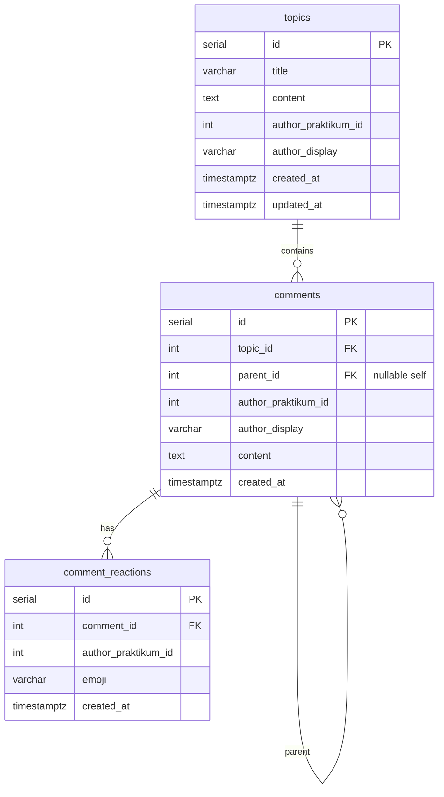

# Форум: Требования API и план реализации
 
Текущее состояние: 
['forumSlice.ts'](../packages/client/src/slices/forumSlice.ts) (демо-данные), типы ['forum.ts'](../packages/client/src/types/forum.ts), страницы ['ForumPage'](../packages/client/src/pages/ForumPage.tsx), ['ForumTopicPage'](../packages/client/src/pages/ForumTopicPage.tsx). Роуты '/forum', '/forum/:topicId' уже **за 'withAuthGuard'** — при отказе авторизации редирект на '/login' (['withAuthGuard.tsx'](../packages/client/src/hoc/withAuthGuard.tsx)).

Бэкенд монорепы: ['packages/server'](../packages/server/index.ts) — Express, PostgreSQL через ['db.ts'](../packages/server/db.ts), проверка сессии Практикума в ['requirePraktikumAuth'](../packages/server/middleware/requirePraktikumAuth.ts) (сейчас ответы **401**; для форума по заданию — **403**, см. ниже).

---

## 1. Требования к API (сводка)

| # | Требование | Решение |
|---|------------|---------|
| 1 | Стек: PostgreSQL 12+, Sequelize, Docker Compose | Уже есть Postgres в ['docker-compose.yml'](../docker-compose.yml); сервер подключается через 'POSTGRES_*' + 'POSTGRES_HOST'. |
| 2 | Все «ручки» форума за авторизацией | Общий middleware: нет валидной сессии Практикума → **403** + JSON '{ "reason": "..." }'. |
| 3 | Несколько топиков | CRUD минимум: список, создание, чтение одного. |
| 4 | Сущности: топик, комментарий, дерево ответов, реакции | См. §3–4. |
| 5 | XSS / SQL-injection | Текст как **plain text**, лимиты длины, без HTML; Sequelize — параметризованные запросы; при отдаче в JSON экранирование на клиенте (React по умолчанию). |
| 6 | Неавторизован → **403** на Node | Единый 'requireForumAuth' (или расширение текущего middleware): без cookie / 'GET /auth/user' не 200 → **403 Forbidden** (не путать с 401 «WWW-Authenticate»; по ТЗ — именно 403). |
| 7 | Клиент: заглушка / скрытие | Уже: гард + 'Navigate' на '/login'. Дополнительно: при **403** от API — toast + редирект или блок формы создания темы (итерация «подключение API»). |

---

## 2. REST API (черновик контракта)

Базовый префикс: **'/api/forum'** (совпадает с комментариями в 'forumSlice').  
Клиент шлёт **'Cookie'** (как к Практикуму); сервер пробрасывает cookie в 'GET {PRAKTIKUM_API_URL}/auth/user' и кладёт в 'req' объект пользователя (минимум 'id', 'login' или 'display_name' для отображения).

### 2.1 Топики

| Метод | Путь | Описание |
|-------|------|----------|
| 'GET' | '/api/forum/topics' | Список топиков. Query: 'limit' (default 20), 'offset' или 'page'. |
| 'GET' | '/api/forum/topics/:topicId' | Одна тема + метаданные ('commentsCount' можно считать агрегатом). |
| 'POST' | '/api/forum/topics' | Создание. Body JSON: '{ "title": string, "content": string }'. Поле 'author' **не доверять** с клиента — брать из сессии. |
| 'DELETE' | '/api/forum/topics/:topicId' | Опционально в v2 (модерация / автор-владелец). |

Ответы списка/одного топика — совместимы с типом ['ForumTopic'](../packages/client/src/types/forum.ts): 'id', 'title', 'author' (строка для UI), 'createdAt' (ISO), 'content', 'commentsCount'.

### 2.2 Комментарии (дерево)

| Метод | Путь | Описание |
|-------|------|----------|
| 'GET' | '/api/forum/topics/:topicId/comments' | Все комментарии темы (плоский массив с 'parentCommentId' — как сейчас на клиенте; дерево строится на клиенте). |
| 'POST' | '/api/forum/topics/:topicId/comments' | Создание. Body: '{ "content": string, "parentCommentId": number | null }'. |

Тип ответа — как ['ForumComment'](../packages/client/src/types/forum.ts): 'id', 'topicId', 'author', 'content', 'createdAt', 'parentCommentId'.

**Рекурсия:** одна таблица 'comments' с 'parent_id → comments.id'; глубина не ограничена на уровне БД, на API — опциональный 'maxDepth' или лимит длины цепочки в валидации.

### 2.3 Реакции (эмоции)

| Метод | Путь | Описание |
|-------|------|----------|
| 'GET' | '/api/forum/topics/:topicId/comments/:commentId/reactions' | Список реакций (группировка по emoji + count + «моя реакция»). |
| 'PUT' или 'POST' | '/api/forum/comments/:commentId/reactions' | Поставить реакцию. Body: '{ "emoji": string }' (например один Unicode символ из whitelist). |
| 'DELETE' | '/api/forum/comments/:commentId/reactions/:emoji' | Снять свою реакцию данного типа. |

Whitelist эмодзи — тот же набор, что на UI в ['ForumTopicPage'](../packages/client/src/pages/ForumTopicPage.tsx) ('EMOJIS'), чтобы не принимать произвольные строки.

### 2.4 Коды ошибок

| Код | Когда |
|-----|--------|
| **403** | Нет cookie или сессия Практикума недействительна — для всех защищённых ручек форума. |
| **400** | Валидация (пустой title, слишком длинный 'content', неверный 'parentCommentId', emoji вне whitelist). |
| **404** | 'topicId' / 'commentId' не существует. |
| **409** | Опционально: дубликат реакции (если не делаем идемпотентный upsert). |
| **500** | Внутренняя ошибка БД / непойманное исключение. |

Тело ошибки: '{ "reason": "краткий код или сообщение" }' — как на Практикуме, для единообразия с ['praktikumAuthErrors'](../packages/client/src/shared/utils/praktikumAuthErrors.ts).

---

## 3. Схема базы данных (логическая)

**Идентификация автора:** 'author_praktikum_id' — числовой 'id' из ответа 'GET /auth/user' Практикума; 'author_display' — снимок строки ('display_name' / 'login') на момент создания, чтобы не дергать Практикум на каждый список.

**Индексы (минимум):** 'comments(topic_id)', 'comments(parent_id)', 'comment_reactions(comment_id)', уникальность **'UNIQUE(comment_id, author_praktikum_id, emoji)'** — один пользователь — одна реакция данного типа на комментарий.

---

## 4. Модели Sequelize (намётка)

| Модель | Таблица | Связи |
|--------|---------|--------|
| 'Topic' | 'topics' | 'hasMany(Comment)' |
| 'Comment' | 'comments' | 'belongsTo(Topic)', 'belongsTo(Comment, as: 'parent')', 'hasMany(Comment, as: 'replies')', 'hasMany(CommentReaction)' |
| 'CommentReaction' | 'comment_reactions' | 'belongsTo(Comment)' |

Хуки 'beforeCreate': нормализация пробелов, trim 'title'/'content'.  
Валидация Sequelize: 'len', 'notEmpty', 'isIn' для emoji.

---

## 5. Аутентификация и авторизация на сервере

1. **Middleware** (например 'attachPraktikumUser' + 'requireForumUser'):
   - читает 'Cookie' из входящего запроса;
   - 'fetch(PRAKTIKUM_API + '/auth/user', { headers: { cookie } })';
   - при успехе: 'req.forumUser = await r.json()' (или подмножество полей);
   - при неуспехе: **'res.status(403).json({ reason: 'Forbidden' })'** — **без вызова 'next()'**.

2. Все маршруты '/api/forum/**' вешаются **после** этого middleware (или 'router.use(requireForumUser)').

3. В контроллерах **'author_praktikum_id' = req.forumUser.id'**, строка для UI — из профиля; игнорировать клиентский 'author' из body (как сейчас передаётся в ['CreateTopicPayload'](../packages/client/src/types/forum.ts) — убрать при интеграции API).

---

## 6. Защита XSS и SQL-injection

| Угроза | Мера |
|--------|------|
| **SQL-injection** | Только Sequelize / 'query' с bind-параметрами; без конкатенации SQL строк. |
| **XSS** | Хранить как текст; 'Content-Type: application/json'; не отдавать 'text/html' из пользовательского ввода; лимиты: например 'title' ≤ 255, 'content' ≤ 32_000 символов; отклонять нулевые байты и управляющие символы по политике. |
| **Перегрузка** | Rate limiting опционально позже. |

---

## 7. Клиент: следующая итерация после бэкенда

- Заменить демо в ['forumSlice.ts'](../packages/client/src/slices/forumSlice.ts) на 'fetch'/'apiClient' к **'SERVER_HOST' или отдельному 'VITE_FORUM_API_URL'** (согласовать с Docker: прокси с клиента SSR на 'server:3001' или прямой порт с хоста).
- Убрать передачу 'author' из формы; подставлять с сервера в ответе.
- Расширить типы под **реакции** (массив или map 'emoji → count' + флаг «моя»).
- При **403**: редирект на '/login' или сообщение «Войдите, чтобы участвовать в форуме» (соответствие ТЗ «заглушка»).

---

## 8. План итераций (после шага 1)

| Итерация | Содержание |
|----------|------------|
| **2** | Sequelize: 'sequelize-cli', конфиг из env, папка 'models/', 'migrations/' первая миграция 'topics' + 'comments' + 'comment_reactions'. |
| **3** | Регистрация моделей, ассоциации, сиды опционально для dev. |
| **4** | Express: 'express.json()', роутер '/api/forum', middleware 403, контроллер топиков + комментариев. |
| **5** | Контроллер реакций + тесты интеграции (supertest) или e2e smoke. |
| **6** | Подключение клиента, удаление демо-массивов, обработка ошибок. |

---

## 9. Открытые вопросы (обсудить на ревью)

1. **Удаление / редактирование** топиков и комментариев — только автор или роль модератора?  
2. **Пагинация** комментариев для очень длинных тем.  
3. **Единый порт**: сейчас 'SERVER_HOST' в ['constants.tsx'](../packages/client/src/constants.tsx) указывает на '3000' (клиент SSR); реальные демо-ручки '/friends' на пакете 'server' — '3001'. Нужна одна переменная окружения для **бэкенда форума** на всех средах.  
4. Синхронизация **403** с существующим 'requirePraktikumAuth' (401) для '/friends' — оставить различие (форум = 403 по ТЗ, старые ручки = 401) или унифицировать.

---

