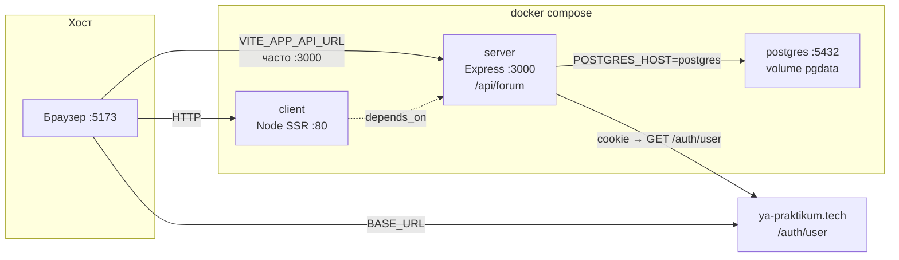

# Серверная инфраструктура форума (Docker + env)

Документ для задачи **«Серверная инфраструктура для форума»** на ветке `feature/8.8-forum-infra`.

Связанные материалы:

- [forum-api-spec.md](./forum-api-spec.md) — контракт REST `/api/forum`, миграции, middleware.
- Можно влить изменения из других веток финальной проверкой Docker):
  - [#129 — 8.4 auth backend](https://github.com/kirillchistov/42-gamedev-teamwork/pull/129) → ветка `feature/8.4-auth-backend`
  - [#128 — 8.3 theme client + backend](https://github.com/kirillchistov/42-gamedev-teamwork/pull/128) → ветка `feature/8.3-theme-client`


---

## 1. Требования задачи и статус

| Требование | Статус | Комментарий |
|------------|--------|-------------|
| Сервер и БД «обёрнуты» в Docker | **Частично готово** | Образы `Dockerfile.server`, `postgres:16-alpine`; клиент тоже в Compose (SSR, не nginx). |
| Корректные зависимости в `docker-compose` | **Частично готово** | `server` ждёт **healthy** `postgres`; `client` — только `depends_on: server` без healthcheck API. |
| Секреты не в репозитории | **Готово** | `.env` в `.gitignore`; в git только `.env.sample` с **тестовыми** локальными значениями. |
| Логины/пароли через env | **Готово** | `POSTGRES_*`, `SERVER_PORT`, `CLIENT_PORT` из `.env` → подстановка в Compose. |

**Итог:** базовый Compose-стек для форума **есть**; для полного закрытия задачи остаются **миграции при деплое**, **healthcheck server** и **жёсткий порядок client → server → postgres** (см. §5).

---

## 2. Архитектура (текущая)



| Сервис | Образ / сборка | Роль для форума |
|--------|----------------|-----------------|
| **postgres** | `postgres:16-alpine` | Таблицы `topics`, `comments`, `comment_reactions` после `yarn db:migrate`. |
| **server** | `Dockerfile.server` → `cosmic-match-server` | API `/api/forum/*`, auth `requirePraktikumAuth`. |
| **client** | `Dockerfile.client` → `cosmic-match-client` | UI форума; в Docker **не** проксирует API (см. §5.3). |

Порты на хосте по умолчанию (из [`.env.sample`](../.env.sample)):

| Сервис | Внутри контейнера | На хосте |
|--------|-------------------|----------|
| client | 80 | **5173** (`CLIENT_PORT`) |
| server | 3000 | **3000** (`SERVER_PORT`) |
| postgres | 5432 | **5432** (`POSTGRES_PORT`) |

---

## 3. Что уже есть в репозитории

### 3.1. Docker Compose

[`docker-compose.yml`](../docker-compose.yml) — три сервиса, volume `pgdata`, healthcheck Postgres:

```yaml
services:
  postgres:
    image: postgres:16-alpine
    environment:
      POSTGRES_USER: ${POSTGRES_USER:-postgres}
      POSTGRES_PASSWORD: ${POSTGRES_PASSWORD:-postgres}
      POSTGRES_DB: ${POSTGRES_DB:-postgres}
    healthcheck:
      test: ["CMD-SHELL", "pg_isready -U \"$$POSTGRES_USER\" -d \"$$POSTGRES_DB\" || exit 1"]

  server:
    build:
      dockerfile: Dockerfile.server
    environment:
      POSTGRES_HOST: postgres
      POSTGRES_PORT: "5432"
      POSTGRES_USER: ${POSTGRES_USER:-postgres}
      POSTGRES_PASSWORD: ${POSTGRES_PASSWORD:-postgres}
      POSTGRES_DB: ${POSTGRES_DB:-postgres}
    depends_on:
      postgres:
        condition: service_healthy

  client:
    build:
      dockerfile: Dockerfile.client
    ports:
      - "${CLIENT_PORT:-5173}:80"
    depends_on:
      - server
```

Секреты **не захардкожены** в compose: только `${POSTGRES_PASSWORD:-postgres}` как fallback для локальной разработки (допустимо по ТЗ как тестовые данные).

### 3.2. Образ API-сервера

[`Dockerfile.server`](../Dockerfile.server) — multi-stage: сборка `packages/server` → production-образ с `node packages/server/dist/index.js`.

В образ попадает **только `dist/`**, без `migrations/` и `config/` для sequelize-cli — миграции с хоста (§4).

### 3.3. Подключение к БД и env

[`packages/server/sequelize.ts`](../packages/server/sequelize.ts):

```typescript
const host = process.env.POSTGRES_HOST ?? 'localhost'
const port = Number(process.env.POSTGRES_PORT ?? 5432)
const database = process.env.POSTGRES_DB ?? 'postgres'
const username = resolvePostgresUser()
const password = process.env.POSTGRES_PASSWORD ?? 'postgres'
```

Для **Docker** `POSTGRES_HOST=postgres` задаётся в compose (имя сервиса в сети).

[`packages/server/config/database.cjs`](../packages/server/config/database.cjs) — те же `POSTGRES_*` для `yarn db:migrate` (читает корневой `.env`).

### 3.4. API форума

[`packages/server/createApp.ts`](../packages/server/createApp.ts):

```typescript
app.use('/api/forum', requirePraktikumAuth, forumRouter)
```

Роутер: [`packages/server/routes/forumRouter.ts`](../packages/server/routes/forumRouter.ts).  
Миграция: [`packages/server/migrations/20260514120000-create-forum-tables.js`](../packages/server/migrations/20260514120000-create-forum-tables.js).

### 3.5. Секреты и `.env`

| Файл | В git | Назначение |
|------|-------|------------|
| `.env` | **Нет** (`.gitignore`) | Локальные пароли и порты разработчика. |
| `.env.sample` | **Да** | Шаблон; значения `postgres/postgres` — только для локали/Docker. |
| `init.js` | **Да** | `fs.copyFileSync('.env.sample', '.env')` перед первым запуском. |

Дополнительные переменные (не секреты Практикума, но конфиг форума):

- `FORUM_MODERATOR_PRAKTIKUM_IDS` — id модераторов ([`forumAccess.ts`](../packages/server/routes/forumAccess.ts)); в compose **пока не проброшена** — задать в `.env` при локальном `yarn dev:server` или добавить в `server.environment` (§5).

---

## 4. Сборка и запуск (инструкция)

### 4.1. Первичная настройка

Перед первым запуском убедитесь, что в ветку влиты **§9** (`feature/8.4-auth-backend`, `feature/8.3-theme-client`), иначе не будет `apiProxy`, актуального `createApp` и миграции тем.

```bash
# из корня монорепы
node init.js          # создаёт .env из .env.sample
yarn install
```

Проверьте `.env` (минимум для Docker + миграций с хоста):

```env
POSTGRES_HOST=localhost
POSTGRES_PORT=5432
POSTGRES_USER=postgres
POSTGRES_PASSWORD=postgres
POSTGRES_DB=postgres
SERVER_PORT=3000
CLIENT_PORT=5173
VITE_APP_API_URL=http://localhost:3000
```

> **Миграции с хоста:** `POSTGRES_HOST=localhost` — к Postgres в Docker через проброс порта `5432`.  
> **Сервер в Docker:** в compose уже `POSTGRES_HOST=postgres` (переопределяет .env внутри контейнера).

### 4.2. Postgres и миграции (обязательно для форума)

После merge **#128** (`feature/8.3-theme-client`) появится вторая миграция (`anonymous_sessions`, `user_ui_themes`) — `yarn db:migrate` применит **все** pending-миграции.

```bash
docker compose up -d postgres
yarn db:migrate
```

Проверка таблиц:

```bash
docker exec -it cosmic-match-postgres psql -U postgres -d postgres -c "\dt"
```

Ожидаются `topics`, `comments`, `comment_reactions`, `SequelizeMeta`.

Опционально демо-данные:

```bash
yarn db:seed
```

### 4.3. Сборка и подъём стека

```bash
docker compose build server client
docker compose up
```

| URL | Назначение |
|-----|------------|
| http://localhost:5173 | Клиент (SSR) |
| http://localhost:3000/ | Liveness API (`👋 Howdy…`) |
| http://localhost:3000/api/forum/topics | Список тем (нужна сессия Практикума, см. §6) |

Один сервис:

```bash
docker compose up server
```

### 4.4. Локальная разработка без полного Docker UI

```bash
docker compose up -d postgres
yarn db:migrate
yarn dev    # client :5173 + server :3000
```

---

## 5. Что ещё требуется реализовать (backlog задачи)

### 5.1. Миграции в Docker-процессе

**Сейчас:** миграции **не** выполняются при старте контейнера `server` → без `yarn db:migrate` форум отдаёт **500** (`Topic.findAll` без таблиц).

**Варианты:**

1. **Сервис `migrate` в compose** (рекомендуется для CI/коллег):

```yaml
  migrate:
    image: cosmic-match-server
    build:
      dockerfile: Dockerfile.server
    environment:
      POSTGRES_HOST: postgres
      POSTGRES_USER: ${POSTGRES_USER:-postgres}
      POSTGRES_PASSWORD: ${POSTGRES_PASSWORD:-postgres}
      POSTGRES_DB: ${POSTGRES_DB:-postgres}
    command: ["npx", "sequelize-cli", "db:migrate"]
    depends_on:
      postgres:
        condition: service_healthy
```

Для этого в образ нужно добавить `migrations/`, `config/`, `sequelize-cli` (сейчас в production-образе только `dist/`).

2. **Entrypoint** `server`: `sequelize-cli db:migrate && node packages/server/dist/index.js`.

3. **Документированный ручной шаг** (уже используется командой) — оставить, но явно в README/CI.

### 5.2. Зависимости и healthcheck `server`

**Сейчас:** `client` стартует после **создания** контейнера `server`, но не ждёт готовности HTTP/БД.

**Рекомендуется:**

```yaml
  server:
    healthcheck:
      test: ["CMD-SHELL", "wget -qO- http://127.0.0.1:$$SERVER_PORT/ || exit 1"]
      interval: 5s
      timeout: 3s
      retries: 5
      start_period: 15s

  client:
    depends_on:
      server:
        condition: service_healthy
```

(или `curl` в образе server.)

### 5.3. Клиент Docker и сессия Практикума (форум)

**Без ветки [#129](https://github.com/kirillchistov/42-gamedev-teamwork/pull/129):** клиент ходит на `VITE_APP_API_URL` (`:3000`), cookie Практикума не доходят → **403/500** на форуме.

**На ветке `feature/8.202-forum-chores` (после merge #129):** same-origin прокси [`apiProxy.ts`](../packages/client/server/apiProxy.ts), `registerApiProxy` в `server/index.ts`, env в `docker-compose` для `client`, `forumAuthRedirect`, относительные URL в `constants.tsx` (`/api/v2`, пустой `SERVER_HOST` в браузере).

**Если прокси ещё не влит** — выполнить команды из **§9.2** или вручную:

- `registerApiProxy(app)` в SSR-сервере клиента;
- в `docker-compose.yml` для `client`:

```yaml
    environment:
      INTERNAL_SERVER_URL: http://server:3000
      PRAKTIKUM_API_URL: https://ya-praktikum.tech
```

- в бандле браузера: относительные `/api/v2` и `/api/forum` (ветка #129 / #128).

### 5.4. Проброс env модераторов и CORS

- Добавить в `server.environment` compose: `FORUM_MODERATOR_PRAKTIKUM_IDS: ${FORUM_MODERATOR_PRAKTIKUM_IDS:-}`.
- При прямых запросах браузера на `:3000` — `cors({ origin: true, credentials: true })` в `createApp` (сейчас `cors()` без credentials).

### 5.5. README

В [README.md](../README.md) указан «nginx» для client — фактически **Node SSR** ([`Dockerfile.client`](../Dockerfile.client)). Имеет смысл обновить §Production окружение и сослаться на этот документ.

---

## 6. Проверка соответствия заданию (чеклист)

Выполняйте из **корня репозитория** после `node init.js` и правки `.env`.

### A. Секреты не в git

```bash
git check-ignore -v .env
# ожидаем: .gitignore:3:.env

git grep -n "POSTGRES_PASSWORD=." -- ':!*.sample' ':!docs/*' ':!docker-compose.yml'
# в tracked-файлах не должно быть реальных прод-паролей
```

### B. Docker: сервисы и зависимости

```bash
docker compose config | grep -A3 'depends_on'
docker compose up -d postgres
docker compose ps
# postgres — healthy
docker compose up -d server
docker compose logs server | tail -5
# «Connected to the database», «listening on port: 3000»
```

### C. Миграции и форум (данные)

```bash
yarn db:migrate
docker exec cosmic-match-postgres psql -U postgres -d postgres -c "SELECT COUNT(*) FROM topics;"
curl -s -o /dev/null -w "%{http_code}\n" http://localhost:3000/api/forum/topics
# без cookie: 403 — норма (auth работает)
# с невалидной сессией: 403; после миграций не 500 из-за «relation does not exist»
```

### D. Env пробрасывается в server

```bash
docker compose exec server node -e "console.log(process.env.POSTGRES_HOST, process.env.POSTGRES_USER)"
# ожидаем: postgres postgres
```

### E. UI (ручной)

1. http://localhost:5173 — войти (Практикум).
2. `/forum` — Network: `topics` → **200** (не 500).
3. Создать тему — **POST** `/api/forum/topics` → **201/200**.

---

## 7. Типичные проблемы

| Симптом | Причина | Решение |
|---------|---------|---------|
| `yarn db:migrate` → `role "postgres" does not exist` | На `localhost:5432` отвечает **Homebrew Postgres**, а не Docker (роль `postgres` есть только в контейнере) | `lsof -i :5432`; в `.env` поставить **`POSTGRES_PORT=5433`**, `docker compose up -d postgres`, снова `yarn db:migrate`; или `yarn db:migrate:docker` |
| `topics` → **500** | Нет таблиц | `yarn db:migrate` |
| `topics` → **403**, cookie есть | Прямой вызов `:3000` без cookie Практикума | same-origin прокси (§5.3) или dev с обходом `LOCAL_PRAKTIKUM_AUTH_BYPASS=1` только не в production |
| `bind: address already in use :5173` | Занят `yarn dev` | Остановить dev или `CLIENT_PORT=5174` в `.env` |
| `pull access denied for cosmic-match-server` | Compose ищет образ в registry | `docker compose build server` |

---

## 8. Связь с задачей «API форума»

| Компонент API (готово) | Инфраструктура |
|------------------------|----------------|
| `forumRouter`, модели, миграция | Нужен Postgres + `db:migrate` |
| `requirePraktikumAuth` | В Docker — внешний Практикум; bypass только dev |
| Клиент `forumApi.ts` | Нужен доступный `VITE_APP_API_URL` / прокси |

Задача **инфраструктуры** не дублирует REST-контракт, а обеспечивает **повторяемый запуск** server + postgres + env и порядок старта в Compose.

---

## 9. Слияние веток с review в `feature/8.8-forum-infra`

Цель: перед доработкой инфраструктуры и проверкой §6 подтянуть в рабочую ветку код из открытых PR, **не дожидаясь** их merge в `dev`.

| PR | Ветка | Что даёт для инфраструктуры / форума |
|----|-------|--------------------------------------|
| [#129](https://github.com/kirillchistov/42-gamedev-teamwork/pull/129) | `feature/8.4-auth-backend` | `resolvePraktikumUser`, `protectedRouter`, **apiProxy**, CORS/credentials, Docker env для `client`, `forumAuthRedirect`, фиксы Docker server |
| [#128](https://github.com/kirillchistov/42-gamedev-teamwork/pull/128) | `feature/8.3-theme-client` | `/api/ui/theme`, миграция тем, `ThemeServerSync`, расширение `.env.sample` |

Рекомендуемый порядок: **сначала auth (#129), затем theme (#128)** — обе трогают `docker-compose.yml`, `createApp.ts`, `.env.sample`; auth задаёт каркас API-сервера и прокси клиента.

### 9.1. Подготовка

```bash
cd /path/to/42-gamedev-teamwork

# сохранить незакоммиченное
git status

git fetch origin

git checkout feature/8.8-forum-infra

# опционально: убедиться, что база актуальна относительно dev
git merge origin/dev
# при конфликтах — разрешить, git add …, git commit
```

### 9.2. Merge 8.4 — авторизация на бэкенде (PR #129)

```bash
git merge origin/feature/8.4-auth-backend -m "merge: feature/8.4-auth-backend into forum-infra"
```

Типичные файлы при конфликтах:

| Файл | На что смотреть |
|------|----------------|
| `docker-compose.yml` | `INTERNAL_SERVER_URL`, `PRAKTIKUM_API_URL` у `client`; `depends_on` / healthcheck |
| `packages/server/createApp.ts` | `protectedRouter` + `requirePraktikumAuth` на `/api/forum`, `/friends`, `/user` |
| `packages/server/middleware/requirePraktikumAuth.ts` | делегирование в `resolvePraktikumUser` |
| `packages/client/server/index.ts` | вызов `registerApiProxy(app)` |
| `packages/client/package.json` | зависимость `http-proxy-middleware` |
| `.env.sample` | прокси, `PRAKTIKUM_API_URL`, комментарии по портам |

После разрешения конфликтов:

```bash
git add -A
git status
# если merge не завершён:
git commit   # только если merge остановился на конфликтах

yarn install
yarn workspace client build:ssr-server
yarn workspace server build
```

### 9.3. Merge 8.3 — темизация (PR #128)

```bash
git merge origin/feature/8.3-theme-client -m "merge: feature/8.3-theme-client into forum-infra"
```

Типичные файлы при конфликтах:

| Файл | На что смотреть |
|------|----------------|
| `packages/server/createApp.ts` | публичный `/api/ui/theme` + `attachPraktikumUser` **без** жёсткого 403 для гостя |
| `packages/server/migrations/20260516130000-create-ui-theme-tables.js` | не потерять миграцию |
| `packages/client/src/constants.tsx` | в браузере относительные `/api/v2` и пустой `SERVER_HOST` |
| `docs/project-themization.md` | при необходимости оставить оба документа |

Завершение merge и зависимости:

```bash
git add -A
git commit   # при необходимости

yarn install
yarn db:migrate
```

### 9.4. Проверка после обоих merge

```bash
# типы и тесты
yarn workspace server build
yarn workspace server test
yarn workspace client typecheck

# Docker (§4.3)
docker compose build server client
docker compose up -d postgres
yarn db:migrate
docker compose up

# форум + тема (браузер http://localhost:5173)
# Network: GET /api/forum/topics → 200
# Network: GET /api/ui/theme → 200
```

### 9.5. Альтернатива: rebase (если ветка ещё не пушили)

```bash
git checkout feature/8.8-forum-infra
git fetch origin
git rebase origin/dev
git rebase origin/feature/8.4-auth-backend
git rebase origin/feature/8.3-theme-client
```

После rebase обновление remote (только если ветка уже была на remote и команда согласна):

```bash
git push --force-with-lease origin feature/8.8-forum-infra
```

### 9.6. Отмена merge при ошибке

```bash
git merge --abort
# или до коммита отката:
git reset --hard ORIG_HEAD
```

---

*Документ актуален для ветки `feature/8.8-forum-infra`. После merge PR [#129](https://github.com/kirillchistov/42-gamedev-teamwork/pull/129) и [#128](https://github.com/kirillchistov/42-gamedev-teamwork/pull/128) обновите §3 (фактическое состояние) и отметьте выполненные пункты §5.*
