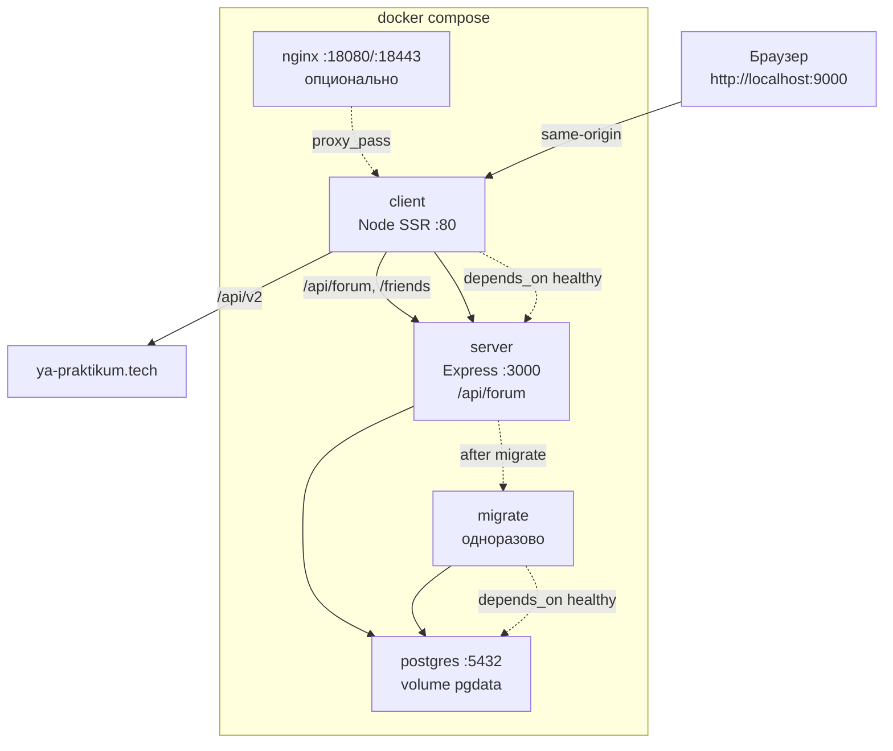

# Серверная инфраструктура форума (Docker + env)

Документ описывает **текущий** Docker-стек монорепозитория: PostgreSQL, миграции, API (`packages/server`), SSR-клиент с **same-origin прокси** и опциональный **nginx** (спринты **8** и **9**).

Связанные материалы:

- [forum-api-spec.md](./forum-api-spec.md) — REST `/api/forum`, модели, middleware.
- [forum-api-client.md](./forum-api-client.md) — клиент, `apiProxy`, порты в dev.
- [yacloud-deploy.md](./yacloud-deploy.md) — ВМ в Яндекс.Облако, GHCR, nginx, OAuth на проде.
- [autodeploy-action.md](./autodeploy-action.md) — GitHub Actions → образы → деплой.
- [nginx-config.md](./nginx-config.md) — TLS, HTTP/2, `proxy_pass` на client.

---

## 1. Статус (спринты 8–9)

| Требование | Статус |
|------------|--------|
| Server + БД в Docker | **Готово** — `postgres`, `server`, образы `Dockerfile.server` / `Dockerfile.client` |
| Зависимости в Compose | **Готово** — `postgres` → `migrate` → `server` (healthy) → `client`; опционально `nginx` |
| Миграции при деплое | **Готово** — сервис **`migrate`** (одноразовый), скрипт `docker-migrate.sh` |
| Секреты не в git | **Готово** — `.env` в `.gitignore`, шаблон [`.env.sample`](../.env.sample) |
| Прокси Практикума + наш API | **Готово** — [`apiProxy.ts`](../packages/client/server/apiProxy.ts), env `INTERNAL_SERVER_URL` / `PRAKTIKUM_API_URL` |
| Healthcheck API | **Готово** — `GET /health` на `server` |
| Прод / облако | **Готово** — [`docker-compose.prod.yml`](../docker-compose.prod.yml), [yacloud-deploy.md](./yacloud-deploy.md) |

---

## 2. Архитектура

### 2.1. Локально / Docker (браузер)


```mermaid
flowchart TB
  Browser["Браузер\nhttp://localhost:9000"]
  subgraph compose["docker compose"]
    Nginx["nginx :18080/:18443\nопционально"]
    Client["client\nNode SSR :80"]
    Server["server\nExpress :3000\n/api/forum"]
    PG["postgres :5432\nvolume pgdata"]
    Mig["migrate\nодноразово"]
  end
  Praktikum["ya-praktikum.tech"]

  Browser -->|same-origin| Client
  Client -->|/api/v2| Praktikum
  Client -->|/api/forum, /friends| Server
  Nginx -.->|proxy_pass| Client
  Client --> Server
  Mig --> PG
  Server --> PG
  Mig -.->|depends_on healthy| PG
  Server -.->|after migrate| Mig
  Client -.->|depends_on healthy| Server
```

Без nginx UI открывают напрямую **`http://localhost:9000`**. С nginx — **`https://localhost:18443`** (нужны сертификаты в `deploy/nginx/certs/`, см. `deploy/nginx/certs/README.md`).

### 2.2. Яндекс.Облако (прод)

Схема та же, но:

- образы из **GHCR** (`docker-compose.prod.yml`);
- снаружи открыты **22, 80, 443**; **3000, 9000, 5432** — только внутри ВМ / docker-сети;
- nginx на хосте или в compose терминирует TLS и проксирует на `127.0.0.1:9000`.

Подробно: [yacloud-deploy.md](./yacloud-deploy.md).

---

## 3. Сервисы и порты

Источник: [`docker-compose.yml`](../docker-compose.yml).

| Сервис | Роль | Внутри контейнера | На хосте (по умолчанию) |
|--------|------|-------------------|-------------------------|
| **postgres** | БД форума, тем, UI | 5432 | **127.0.0.1:5433** (`POSTGRES_PORT`) |
| **migrate** | `sequelize-cli db:migrate` | — | не публикуется |
| **server** | `/api/forum`, `/friends`, `/user`, `/health` | `SERVER_PORT` | **3000** |
| **client** | SSR + `apiProxy` | 80 | **9000** (`CLIENT_PORT`) |
| **nginx** | TLS, HTTP/2 (задача 9.2) | 80, 443 | **18080**, **18443** |

> **Почему не 5173:** Vite dev — отдельный режим (`yarn dev:client`). В Compose и OAuth whitelist Практикума для UI используется **9000** (см. `.env.sample`).

> **Postgres 5433 на хосте:** на macOS часто занят `:5432` (Homebrew). Миграции с хоста: `POSTGRES_HOST=localhost`, `POSTGRES_PORT=5433`.

### Порядок старта

1. `postgres` — `healthy`
2. `migrate` — `completed_successfully`
3. `server` — `healthy` (`/health`)
4. `client` — после healthy `server`
5. `nginx` — после `client` (если поднимаете весь стек)

---

## 4. Переменные окружения

| Переменная | Где | Назначение |
|------------|-----|------------|
| `POSTGRES_*` | `.env`, compose | Подключение к БД |
| `SERVER_PORT` | `.env` | API (по умолчанию **3000**) |
| `CLIENT_PORT` | `.env` | Проброс SSR (по умолчанию **9000**) |
| `VITE_APP_API_URL` | сборка / SSR prefetch | Прямой URL Node API с хоста/SSR (`http://localhost:3000`) |
| `INTERNAL_SERVER_URL` | `client` в Docker | `http://server:3000` — цель прокси `/api/forum` |
| `PRAKTIKUM_API_URL` | `client` в Docker | Origin Практикума для `/api/v2` |
| `FORUM_MODERATOR_PRAKTIKUM_IDS` | `server` | Модераторы форума |
| `NGINX_HTTP_PORT` / `NGINX_HTTPS_PORT` | локальный compose | **18080** / **18443** (не конфликтовать с 80/443 на ВМ) |

OAuth redirect для локали: `VITE_YANDEX_OAUTH_REDIRECT_URI=http://localhost:9000` — [project-yandex-oauth.md](./project-yandex-oauth.md).

---

## 5. Сборка и запуск

### 5.1. Первичная настройка

```bash
node init.js
yarn install
```

Минимальный `.env` (см. [`.env.sample`](../.env.sample)):

```env
CLIENT_PORT=9000
SERVER_PORT=3000
POSTGRES_HOST=localhost
POSTGRES_PORT=5433
POSTGRES_USER=postgres
POSTGRES_PASSWORD=postgres
POSTGRES_DB=postgres
VITE_APP_API_URL=http://localhost:3000
VITE_YANDEX_OAUTH_REDIRECT_URI=http://localhost:9000
```

### 5.2. Полный стек (рекомендуется)

```bash
docker compose up --build
```

| URL | Назначение |
|-----|------------|
| http://localhost:9000 | UI (SSR), форум — **открывать этот origin** |
| http://localhost:3000/health | Liveness API |
| http://localhost:3000/api/forum/topics | API напрямую (без cookie → **403**, норма) |
| https://localhost:18443 | UI через nginx (после генерации certs) |

Миграции выполняет сервис **`migrate`** автоматически. Ручной повтор:

```bash
yarn db:migrate
# или
yarn db:migrate:docker
```

Проверка таблиц:

```bash
docker exec -it cosmic-match-postgres psql -U postgres -d postgres -c "\dt"
```

### 5.3. Только Postgres + API

```bash
docker compose up -d postgres
yarn db:migrate
docker compose up -d server
```

### 5.4. Dev без Docker UI (частый режим разработки)

```bash
docker compose up -d postgres
yarn db:migrate
yarn dev
```

- UI: **http://localhost:9000** (`yarn dev:client`)
- API: **http://localhost:3000** (`yarn dev:server`)

**Не запускать одновременно** `docker compose up client` и `yarn dev:client` на одном `CLIENT_PORT=9000`.

Подробнее режимы: [sprint-7-8-demo-script.md](./sprint-7-8-demo-script.md).

---

## 6. Форум: same-origin и cookie

В браузере запросы идут на **origin клиента** (`:9000`), не на `:3000`:

- `/api/v2/*` → Практикум (через `apiProxy`);
- `/api/forum/*`, `/friends`, `/user` → `packages/server`.

Cookie сессии Практикума так доходят до нашего API → `requirePraktikumAuth` → **200** на `/api/forum/topics`.

Прямой `fetch('http://localhost:3000/api/forum/...')` из браузера без cookie → **403** (ожидаемо).

В Docker `NODE_ENV=production` → **`LOCAL_PRAKTIKUM_AUTH_BYPASS` не действует**; нужен реальный логин в UI.

---

## 7. Production: GHCR и Яндекс.Облако

### 7.1. Образы

Workflow **Build and push** → GHCR. На ВМ — [`docker-compose.prod.yml`](../docker-compose.prod.yml):

```bash
export CLIENT_IMAGE=ghcr.io/<owner>/42-gamedev-teamwork/client:<sha>
export SERVER_IMAGE=ghcr.io/<owner>/42-gamedev-teamwork/server:<sha>
docker compose -f docker-compose.prod.yml pull
docker compose -f docker-compose.prod.yml up -d
```

Сервисы: `postgres`, `migrate`, `server`, `client`, `nginx` (порты **80/443** на ВМ через `NGINX_*` в `.env`).

Автодеплой: [autodeploy-action.md](./autodeploy-action.md), [deploy/vm/README.md](../deploy/vm/README.md).

### 7.2. Сеть и firewall на ВМ

| Открыто с интернета | Закрыто |
|---------------------|---------|
| 22 (SSH), 80, 443 | 3000, 9000, 5432 |

Проверка до домена: `http://<публичный-IP>:9000` (временно, только для отладки).

### 7.3. Диск на ВМ (~19 ГБ)

Каждый деплой тянет новые слои GHCR. Скрипт `deploy-on-vm.sh` делает `docker image prune -a`. При `no space left on device`:

```bash
docker image prune -a -f
```

Повторить Deploy. См. корневой [README.md](../README.md).

---

## 8. Чеклист проверки

### A. Секреты

```bash
git check-ignore -v .env
```

### B. Compose

```bash
docker compose config
docker compose up -d
docker compose ps
# postgres — healthy, server — healthy, client — up
```

### C. Форум

1. http://localhost:9000 — войти (Практикум / OAuth).
2. `/forum` — Network: `GET /api/forum/topics` → **200**.
3. Создать тему → **POST** `/api/forum/topics` → **201/200**.

### D. Env в server

```bash
docker compose exec server node -e "console.log(process.env.POSTGRES_HOST)"
# postgres
```

---

## 9. Типичные проблемы

| Симптом | Причина | Решение |
|---------|---------|---------|
| `role "postgres" does not exist` при migrate | На `:5432` отвечает Homebrew PG, не Docker | `POSTGRES_PORT=5433`, `docker compose up -d postgres`, `yarn db:migrate` или `yarn db:migrate:docker` |
| `topics` → **500** | Нет таблиц | Дождаться `migrate` или `yarn db:migrate` |
| `topics` → **403**, cookie есть | Запрос на `:3000` вместо `:9000` | Открыть UI на **9000**, проверить `apiProxy` |
| `bind: address already in use :9000` | Параллельно `yarn dev:client` и compose `client` | Остановить один процесс |
| `ECONNREFUSED` к postgres | Postgres не поднят | `docker compose up -d postgres` |
| OAuth redirect mismatch | URI не в whitelist | `http://localhost:9000` без `/` в конце; на проде — [yacloud-deploy.md](./yacloud-deploy.md) |
| Нет места на ВМ | Старые образы Docker | `docker image prune -a -f` |

---

## 10. Связь с задачей «API форума»

| Компонент | Инфраструктура |
|-----------|----------------|
| `forumRouter`, модели | Postgres + `migrate` |
| `requirePraktikumAuth` | Cookie через same-origin `:9000` |
| `forumApi.ts` | Относительный `/api/forum` в браузере |

Задача инфраструктуры обеспечивает **повторяемый** запуск стека и порядок миграций; REST-контракт — в [forum-api-spec.md](./forum-api-spec.md).

---

## Архив

Исторические инструкции по merge веток `feature/8.4-auth-backend` / `feature/8.3-theme-client` в `feature/8.8-forum-infra`: [archive/forum-server-infra-merge-branches.md](./archive/forum-server-infra-merge-branches.md).

---

*Актуально для `main` / спринты 8–9. При смене портов обновите `.env.sample`, этот файл и [yacloud-deploy.md](./yacloud-deploy.md).*
