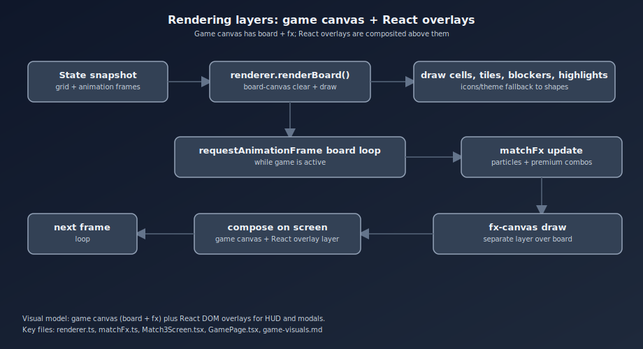
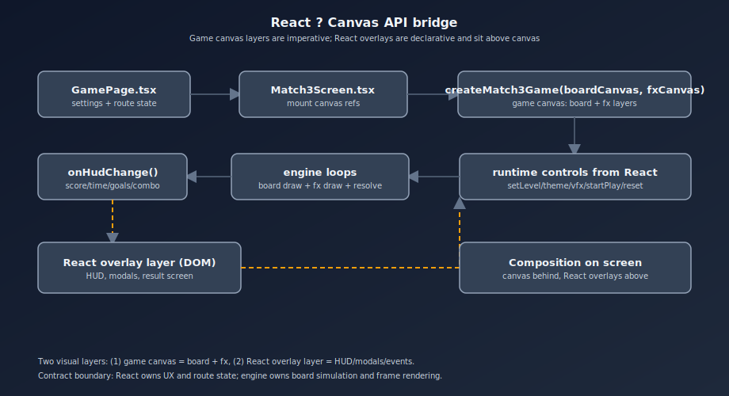
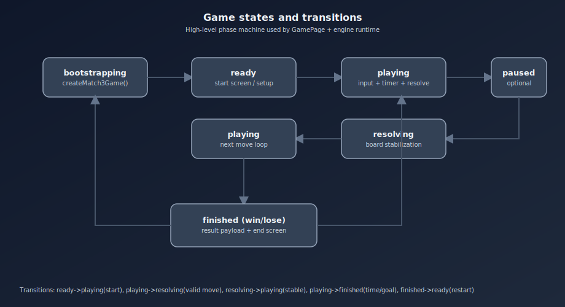
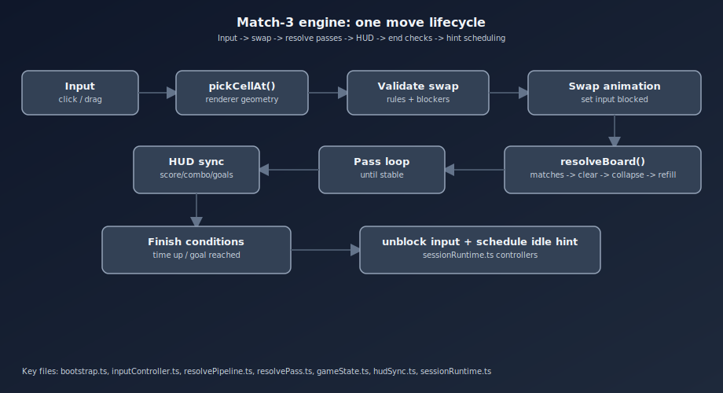
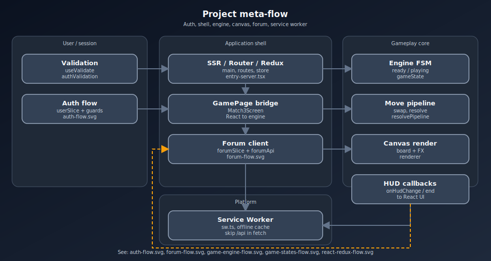

# Визуальная составляющая

## Цель визуального слоя
Визуальная система должна одновременно:
- делать состояние поля считываемым за доли секунды;
- давать яркий "фидбек действия" (матч, каскад, комбо, победа/поражение);
- оставаться стабильной по FPS на разных устройствах.

## Схема взаимодействия с Canvas API
Текущая реализация использует 2 canvas-слоя:
- **board-canvas** - базовая отрисовка сетки, фишек, препятствий, подсветок.
- **fx-canvas** - частицы, вспышки и celebration-эффекты поверх поля.

Пайплайн кадра:
1. 'bootstrap' собирает текущее состояние игры.
2. 'renderer.renderBoard()' рисует основной слой.
3. 'matchFx' обновляет и рисует эффекты в отдельном 'requestAnimationFrame'.
4. UI-оверлеи (React) отображаются поверх canvas при необходимости.

### Анимированная схема: Canvas pipeline

### Анимированная схема: React и Canvas API

## Состояния игры и цикл хода

### Анимированная схема: состояние игры

### Анимированная схема: pipeline игрового хода

## Отрисовка фишек и состояния клеток
- Базовые фишки рисуются векторно (shape-based) или иконками.
- Для спец-фишек рисуются явные маркеры (линия/радиус).
- Для льда и goal-клеток используются отдельные overlay-слои внутри renderer.
- Подсказки, выбор клетки, целевая клетка и highlight матчей имеют отдельные стили.

## Preview: 8x8 поле (SVG)

Пример статичного 8x8-рендера поля без интерактива, с демонстрацией текущих цветов/спецклеток и VFX-оверлеев, плюс визуальные акценты из требований `S7+`:

## Спрайты и иконки
Поддерживаются три визуальных набора:
- 'standard' - геометрические фигуры;
- 'cosmic' - космические иконки;
- 'food' - тематические иконки.

Технически:
- иконки загружаются как 'HTMLImageElement';
- используется кеш по теме ('iconCache');
- есть предварительная загрузка через 'preloadIconTheme';
- при ошибке загрузки используется fallback на shape-рендер.

## Темы и палитры
- Тема поля влияет на палитру фишек ('TILE_COLORS_BY_THEME').
- Доступны темы: 'standard', 'space', 'math'.
- Цвета и стиль должны поддерживать контраст и читаемость на любой стадии партии.

## Текущие механики повышения качества визуала
- Разделение логики и рендера для безопасных визуальных экспериментов.
- Отдельный 'fxCanvas', уменьшающий нагрузку на основной рендер.
- Режим качества VFX: 'full' и 'simple'.
- Плавные анимации обмена/падения с easing-функциями.
- Легкий screen shake и border spark для "премиум" матчей.
- Улучшенный HUD (адаптивная компоновка под desktop/mobile).

## Планируемые улучшения качества (S7+)
- Нормализовать размер фишек в клетке до 80-90%.
- Перевести базовую палитру на 5 ключевых цветов по ТЗ.
- Добавить задние фоны уровня и смену каждые 20 уровней.
- Усилить эффекты бустеров (вертикальные/горизонтальные лучи, area blast).
- Добавить победные/проигрышные анимации экрана результата.

## Оптимизация производительности
- Ограничивать дорогие эффекты на слабых устройствах ('simple' preset).
- Минимизировать лишние перерисовки React-слоя во время активного gameplay.
- Использовать preloading ассетов до старта уровня.
- Контролировать количество частиц и длительность вспышек.
- Профилировать "узкие места" (анимации + ввод + каскады) в devtools.

## Практические правила для команды
- Любой новый визуальный эффект должен иметь деградацию до упрощенного режима.
- Эффект считается принятым только при отсутствии просадок FPS на типовых размерах поля.
- При добавлении ассетов обязательны fallback-стратегии и кеширование.

## Meta-схема архитектуры проекта

Для онбординга новых участников удобно смотреть общую схему связей между auth/валидацией, React-shell, движком, Canvas и Service Worker:

