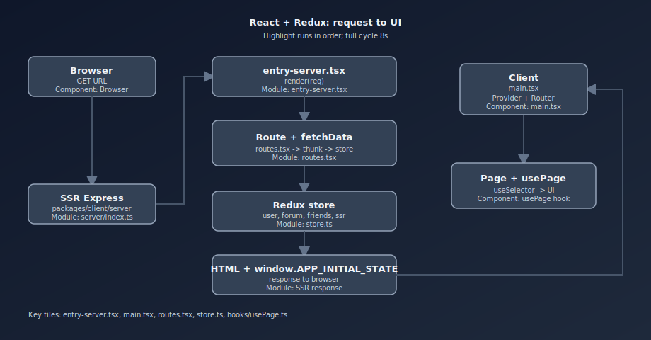
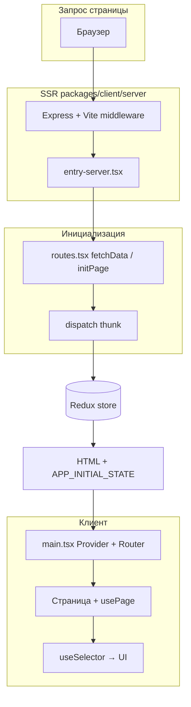

# Структура проекта

## Общая схема монорепозитория

Проект организован как **monorepo** на базе **Lerna** / Yarn workspaces:

- `packages/client` — фронтенд (React + TypeScript + Vite + Canvas, SSR на Express).
- `packages/server` — отдельный Express API (порт по умолчанию **3001**, см. `SERVER_PORT` в [`packages/server/index.ts`](../packages/server/index.ts)).
- `docs` — проектная и игровая документация.
- `docker-compose.yml`, `Dockerfile.*` — локальный и production-запуск в контейнерах.

Шаблон близок к курсовому **SSR на Express + React + Redux Toolkit**: лендинг, страницы авторизации, закрытые разделы после логина, игра match-3.

## Точки входа

### API-сервер (отдельный пакет)

- [`packages/server/index.ts`](../packages/server/index.ts) — поднимает Express, CORS, простые маршруты (`/user`, `/friends` и т.д.), при необходимости БД через `createClientAndConnect`.

### SSR и отдача клиента

- [`packages/client/server/index.ts`](../packages/client/server/index.ts) — Express для SSR: в dev — **Vite** в `middlewareMode`, в prod — статика `dist/client` и серверный бандл; парсинг cookie, сериализация начального состояния Redux в HTML.
- [`packages/client/src/entry-server.tsx`](../packages/client/src/entry-server.tsx) — серверный вход React: функция рендера запроса (HTML, `initialState`, Helmet, стили).
- [`packages/client/src/main.tsx`](../packages/client/src/main.tsx) — клиентский вход: `ReactDOM.createRoot`, **`Provider`**, **`RouterProvider`** (React Router v6), темы, глобальные стили, **ErrorBoundary** / **AppErrorFallback**, оборачивание маршрутов в **`withAuthGuard`**.

## Клиент (`packages/client`)

### Ключевые директории

- `src/pages` — страницы (`/game`, `/login`, `/leaderboard` и т.д.), для многих — пара **компонент + `initXxxPage`** для данных до первого рендера.
- `src/components` — переиспользуемый UI (шапка, футер, лендинг, защита роутов, ошибки).
- `src/game/match3` — модуль игры: `engine` (ядро, рендер, ввод, уровни), `systems` (рекорды и вспомогательное), [`Match3Screen.tsx`](../packages/client/src/game/match3/Match3Screen.tsx) — связка движка с React.
- `src/shared/styles` — глобальные стили, темы, страницы ошибок, форум, match-3.
- `src/shared/ui` — мелкие UI-примитивы (кнопки, поля, карточки, ошибки полей).
- `src/slices` — Redux Toolkit **слайсы**.
- `src/hooks` — `usePage`, `useAuthCheck`, `useValidate` и др.

### Маршруты и жизненный цикл страницы

- Конфиг маршрутов и типы **`PageInitArgs`**, **`PageInitContext`** — в [`src/routes.tsx`](../packages/client/src/routes.tsx). У каждого маршрута: `path`, `Component`, **`fetchData`** (инициализатор страницы).
- Страница обычно экспортирует React-компонент и функцию **`initXxxPage(args)`**, которая возвращает `Promise` (часто `Promise.all([dispatch(thunk), …])`).
- Хук [`usePage`](../packages/client/src/hooks/usePage.ts) в начале компонента страницы:
  - на **SSR** данные подготавливаются до рендера (через `fetchData` на сервере);
  - на **клиенте** при первой загрузке состояние уже в `window.APP_INITIAL_STATE`; при клиентской навигации `usePage` снова вызывает `initPage`, если страница не была инициализирована на сервере (логика завязана на [`ssrSlice`](../packages/client/src/slices/ssrSlice.ts)).

Так UI, SSR и загрузка данных развязаны: страница декларирует зависимости через `fetchData`, стор одинаково собирается на сервере и клиенте.

### Layout и темы

- [**`Header`**](../packages/client/src/components/Header/index.tsx) и [**`Footer`**](../packages/client/src/components/Footer/index.tsx) подключаются на экранах с общей оболочкой сайта.
- Лендинг и смежные страницы используют контейнер `.landing` и темы (**`LandingThemeContext`** в [`contexts/LandingThemeContext.tsx`](../packages/client/src/contexts/LandingThemeContext.tsx)); переключатель темы — в шапке.
- Стили лендинга и секций: [`shared/styles/landing.pcss`](../packages/client/src/shared/styles/landing.pcss).

### UI-kit (`shared/ui`)

Набор обёрток над CSS-классами:

- **Button** — варианты `primary | outline | flat`.
- **LinkButton** — то же через `react-router-dom` / `Link`.
- **Input**, **TextArea** — единый вид форм (auth, контакты, форум).
- **Card** — контейнер карточек.
- **FieldError** — текст ошибки под полем.

### Страницы (примеры назначения)

| Файл | Назначение |
| --- | --- |
| [`LandingPage.tsx`](../packages/client/src/pages/LandingPage.tsx) | Лендинг: hero, преимущества, команда, контакты, секции из `components/Landing/`. |
| [`LoginPage.tsx`](../packages/client/src/pages/LoginPage.tsx) / [`SignupPage.tsx`](../packages/client/src/pages/SignupPage.tsx) | Авторизация и регистрация; валидация через [`authValidation.ts`](../packages/client/src/shared/validation/authValidation.ts). |
| [`GamePage.tsx`](../packages/client/src/pages/GamePage.tsx) | Игра: оболочка, [`Match3Screen`](../packages/client/src/game/match3/Match3Screen.tsx), полноэкранный режим (**F**), настройки уровня/цели. |
| [`ForumPage.tsx`](../packages/client/src/pages/ForumPage.tsx), [`ForumTopicPage.tsx`](../packages/client/src/pages/ForumTopicPage.tsx) | Список тем и топик. |
| [`LeaderboardPage.tsx`](../packages/client/src/pages/LeaderboardPage.tsx) | Лидерборд. |
| [`ProfilePage.tsx`](../packages/client/src/pages/ProfilePage.tsx) | Профиль, API — [`userApi.ts`](../packages/client/src/shared/api/userApi.ts). |
| [`Error404Page.tsx`](../packages/client/src/pages/Error404Page.tsx), [`Error500Page.tsx`](../packages/client/src/pages/Error500Page.tsx) | Страницы ошибок; космический layout — [`CosmicErrorLayout`](../packages/client/src/components/CosmicErrorLayout/CosmicErrorLayout.tsx). |
| [`FriendsPage.tsx`](../packages/client/src/pages/FriendsPage.tsx) | Пример шаблона «страница + thunk»: друзья и пользователь из стора. |

### Ошибки и устойчивость

- [**`ErrorBoundary`**](../packages/client/src/components/ErrorBoundary/index.tsx) ловит ошибки рендера в поддереве.
- [**`AppErrorFallback`**](../packages/client/src/components/AppErrorFallback/index.tsx) — UI для сбоев и `react-router` errorElement (см. [`main.tsx`](../packages/client/src/main.tsx)).

### Авторизация и защита маршрутов

- [**`useAuthCheck`**](../packages/client/src/hooks/useAuthCheck.ts) — проверка сессии / пользователя.
- [**`withAuthGuard`**](../packages/client/src/hoc/withAuthGuard.tsx) оборачивает дерево роутера; публичные пути задаются в [`router/publicRoutePaths.ts`](../packages/client/src/router/publicRoutePaths.ts).
- [**`ProtectedRoute`**](../packages/client/src/components/ProtectedRoute/index.tsx) — редирект неавторизованных с закрытых маршрутов.

## Redux store

- Конфигурация: [`store.ts`](../packages/client/src/store.ts) — **`configureStore`**, `combineReducers`, типы `RootState`, **`AppDispatch`**, обёртки **`useDispatch`**, **`useSelector`**, **`useStore`**.
- На сервере для запроса создаётся стор, заполняется через **`fetchData`**, сериализуется в **`window.APP_INITIAL_STATE`**; на клиенте `preloadedState` читает это значение.

### Слайсы

| Слайс | Роль |
| --- | --- |
| [`userSlice.ts`](../packages/client/src/slices/userSlice.ts) | Текущий пользователь: thunk’и (например загрузка профиля), селекторы вроде `selectUser`. |
| [`friendsSlice.ts`](../packages/client/src/slices/friendsSlice.ts) | Список друзей, загрузка, селекторы. |
| [`forumSlice.ts`](../packages/client/src/slices/forumSlice.ts) | Данные форума. |
| [`ssrSlice.ts`](../packages/client/src/slices/ssrSlice.ts) | Флаги SSR/повторной инициализации для **`usePage`**. |

### Пример паттерна страницы

**`FriendsPage`:** в компоненте — `useSelector` для `friends`, загрузки, `user`; в **`initFriendsPage`** — `dispatch(fetchFriendsThunk())` и при отсутствии пользователя в сторе — `fetchUserThunk()`. Тот же подход масштабируется на форум, лидерборд и др.

## Потоки данных (кратко)

- **React UI** — экраны, модалки, HUD, навигация.
- **Canvas engine** — поле match-3, ввод, анимации, каскады.
- **Server / API** — авторизация, данные форума и лидерборда, персистентность по мере развития; отдельно **SSR** отдаёт HTML с начальным стором.

## Диаграмма: React + Redux и SSR

Анимированная схема (откройте файл в браузере — подсветка шагов по циклу):

Ниже — та же логика в виде статичной Mermaid-схемы (удобно в просмотрщиках с поддержкой Mermaid):

## Сервер (`packages/server`)

HTTP на Express, CORS, тестовые JSON-маршруты; при необходимости — БД через [`db.ts`](../packages/server/db.ts). Точка входа: [`packages/server/index.ts`](../packages/server/index.ts). Новые маршруты и сервисы добавляйте в этом пакете (по мере роста — вынос в `src/` внутри пакета при желании).

## Документация (`docs`)

Требования к игре, бэклог, roadmap, описание движка, гайды по запуску — в этой папке.

## Скрипты верхнего уровня

- `yarn bootstrap` — установка и инициализация монорепо.
- `yarn dev` — клиент и сервер (через Lerna).
- `yarn dev:client` / `yarn dev:server` — отдельно пакет.
- `yarn test`, `yarn lint`, `yarn build`, `yarn format`.

## Куда добавлять новый функционал

- Игровая механика — `packages/client/src/game/match3/engine`.
- Новые экраны / настройки игры — `packages/client/src/pages` и при необходимости `Match3Screen.tsx`.
- API и бизнес-правила на бэкенде — `packages/server`.
- Документация — `docs`.
