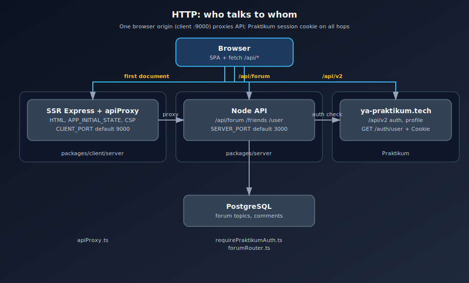
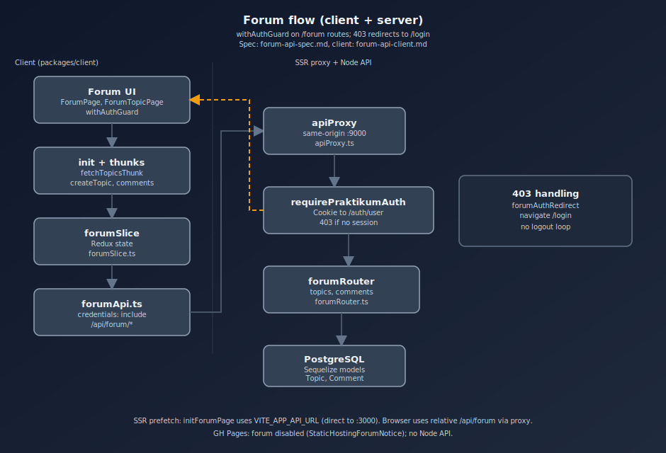
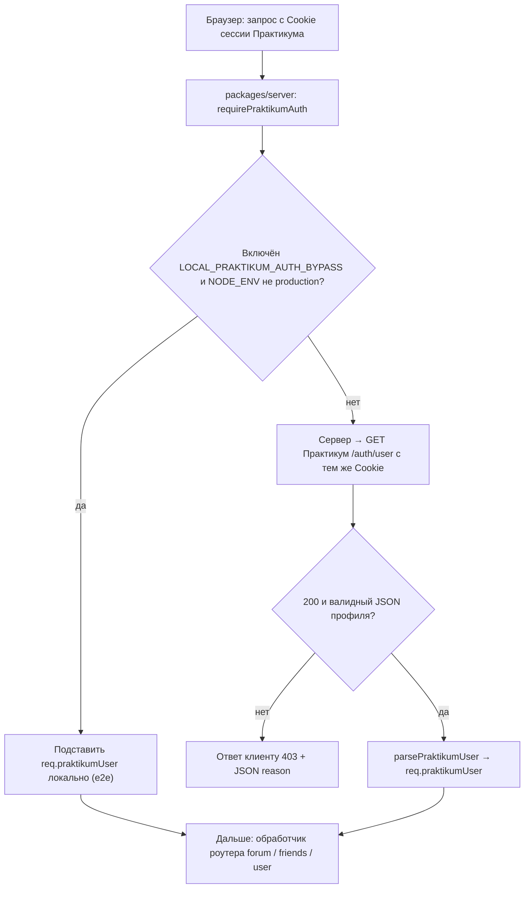
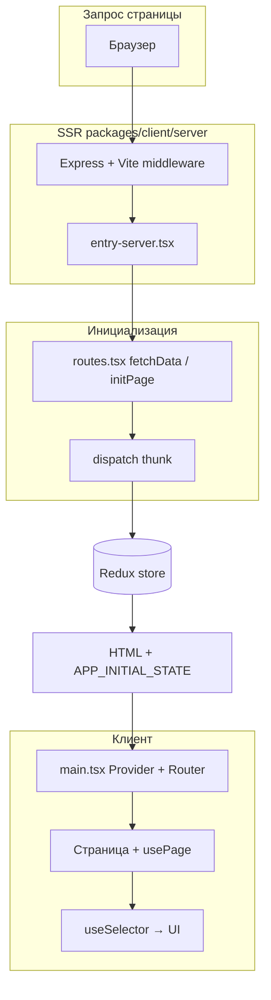
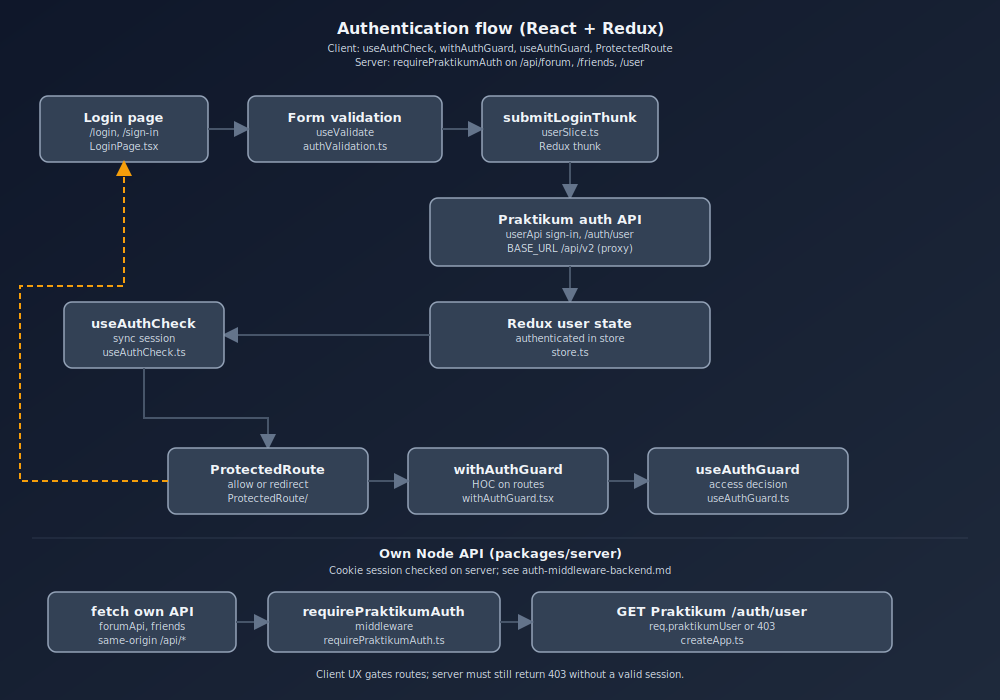
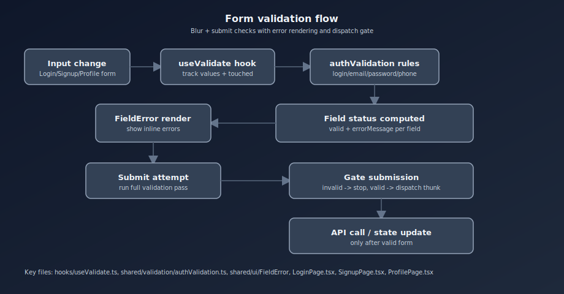
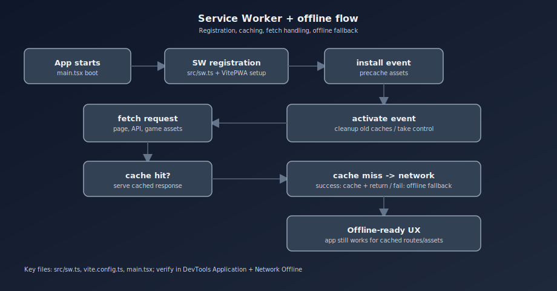

# Структура проекта

## Общая схема монорепозитория

Проект — **monorepo** на **Yarn workspaces** (скрипты верхнего уровня через **Lerna** вызывают `lerna run` по пакетам):

| Путь | Назначение |
| --- | --- |
| [`packages/client`](../packages/client) | Фронтенд: **React + TypeScript + Vite**, игра match-3 на Canvas, **SSR** на отдельном Express внутри этого пакета. |
| [`packages/server`](../packages/server) | **Отдельный** Express API (БД, форум, защищённые JSON-ручки), порт по умолчанию **3000** (`SERVER_PORT`, см. [`index.ts`](../packages/server/index.ts)). |
| [`docs`](./) | Проектная и игровая документация. |
| [`docker-compose.yml`](../docker-compose.yml), `Dockerfile.*` | Локальный и production-запуск в контейнерах. |

Шаблон курсового: **SSR на Express + React + Redux Toolkit** — лендинг, авторизация, закрытые разделы, игра.

---

## Архитектура HTTP: два «бэкенда» и внешнее API

Коллегам важно разделять **три разных HTTP-роли**:

1. **SSR + same-origin прокси** — Express из [`packages/client/server`](../packages/client/server/index.js): HTML, статика, [**`apiProxy.ts`**](../packages/client/server/apiProxy.ts) пробрасывает **`/api/v2`** → Практикум и **`/api/forum`**, **`/friends`**, **`/user`** → `packages/server`. Браузер шлёт `fetch` на **тот же origin**, что и страница (порт клиента, по умолчанию **9000**), с `credentials: 'include'`.
2. **Наш Node API** — Express из [`packages/server`](../packages/server): [`createApp.ts`](../packages/server/createApp.ts), **`/api/forum`**, **`/friends`**, **`/user`**; перед защищёнными ручками — [`requirePraktikumAuth`](../packages/server/middleware/requirePraktikumAuth.ts).
3. **API Практикума** — **`https://ya-praktikum.tech/api/v2`**: логин, профиль, OAuth, лидерборд. В браузере на SSR это путь **`/api/v2`** (через прокси); на **GitHub Pages** — прямой origin (см. [`constants.tsx`](../packages/client/src/constants.tsx), `IS_STATIC_GH_PAGES_DEPLOY`).

### Сводная диаграмма (картинка)

Файлы SVG лежат **в том же каталоге**, что и этот документ (`docs/`). В превью Markdown некоторые IDE берут базовый URL **корня репозитория**, из‑за этого картинки по относительному пути могут не отображаться — тогда откройте файл по ссылке ниже или из дерева проекта.

- Прямая ссылка на файл: [`docs/http-apis-overview.svg`](http-apis-overview.svg)

### Клиент: какой код к какому хосту

- Прямая ссылка: [`client-api-sources.svg`](client-api-sources.svg)
- В браузере **`SERVER_HOST`** пустой → URL вида `/api/forum/...`; **`BASE_URL`** = `/api/v2`. Оба идут через **`apiProxy`** на SSR-сервере.

### Форум: поток запросов

- Прямая ссылка: [`forum-flow.svg`](forum-flow.svg)
- UI → **`forumSlice`** → **`forumApi`** → same-origin **`/api/forum`** → **`requirePraktikumAuth`** → **`forumRouter`** → Postgres. При **403** — редирект на `/login` ([`forumAuthRedirect.ts`](../packages/client/src/shared/forumAuthRedirect.ts)).

### Цепочка middleware на `packages/server` (сессия)

Упрощённая **блок-схема** (без вложенных `alt` в sequenceDiagram — там в рендере Mermaid линии и подписи часто наезжают друг на друга).

**Что такое `alt` в Mermaid (если увидите в других диаграммах):** в **sequenceDiagram** блок **`alt` … `else` … `end`** — это аналог **if / else** в UML: «выполняется ровно одна ветка». Название **alt** = *alternatives* (альтернативы). Рядом бывают **`opt`** (необязательный фрагмент, как *if без else*) и **`par`** (параллельно). Для сложной логики с несколькими уровнями вложенности sequence-диаграмма часто становится нечитаемой; здесь поэтому использован **`flowchart`**.

### Локальная разработка (порты)

| Процесс | Типичный порт | Переменная |
| --- | --- | --- |
| SSR Express (клиент) | **9000** (fallback 8080) | `CLIENT_PORT`, `PORT` |
| Node API (`packages/server`) | **3000** | `SERVER_PORT` |
| PostgreSQL (host) | **5433** (если 5432 занят) | `POSTGRES_PORT` |

В [`.env.sample`](../.env.sample) **`VITE_APP_API_URL=http://localhost:3000`** — для **SSR prefetch** (прямой вызов Node с сервера). Браузер на dev ходит на **`http://localhost:9000/api/...`** через прокси.

### Переменные окружения (связка клиент ↔ сервер)

| Переменная | Где читается | Смысл |
| --- | --- | --- |
| `VITE_APP_API_URL` | Vite `define` → `process.env` в клиенте; dotenv в Jest | База **нашего** API (`SERVER_HOST` в коде). |
| `PRAKTIKUM_API_URL` | `packages/server` middleware | База для проверки сессии (по умолчанию ya-praktikum…/api/v2). |
| `LOCAL_PRAKTIKUM_AUTH_BYPASS` | `packages/server` | Только **не production**: подмена `req.praktikumUser` без запроса к Практикуму (e2e). |
| `FORUM_MODERATOR_PRAKTIKUM_IDS` | `packages/server` [`forumAccess`](../packages/server/routes/forumAccess.ts) | Id модераторов для PATCH/DELETE чужих сущностей. |
| `EXTERNAL_SERVER_URL` / `INTERNAL_SERVER_URL` | Vite `define`, SSR | URL API для серверного рендера / Docker-сети. |

Форум: контракт и детали — [`forum-api-spec.md`](./forum-api-spec.md); краткое ревью — [`forum-api-prr.md`](./forum-api-prr.md).

---

## Точки входа

### API-сервер (`packages/server`)

- [`packages/server/index.ts`](../packages/server/index.ts) — `listen`, подключение БД [`db.ts`](../packages/server/db.ts).
- [`createApp.ts`](../packages/server/createApp.ts) — фабрика Express: **CORS**, **`express.json()`**, маршруты. Защита: **`requirePraktikumAuth`** на **`/api/forum`** и на **`/friends`**, **`/user`**.

### SSR и отдача клиента (`packages/client`)

- [`packages/client/server/index.js`](../packages/client/server/index.js) — Express для SSR: Vite middleware, **`registerApiProxy`**, **CSP** ([`server/csp.ts`](../packages/client/server/csp.ts), см. [`csp.md`](./csp.md)), cookie, `APP_INITIAL_STATE`.
- [`packages/client/src/entry-server.tsx`](../packages/client/src/entry-server.tsx) — серверный вход React: рендер маршрута, `initialState`, Helmet, стили.
- [`packages/client/src/main.tsx`](../packages/client/src/main.tsx) — клиент: `ReactDOM.createRoot`, **Provider**, **RouterProvider** (React Router v6), темы, **ErrorBoundary** / **AppErrorFallback**, обёртки **`withAuthGuard`**.

Детали SSR + Redux + data router: [`project-redux-router-ssr.md`](./project-redux-router-ssr.md); чеклист спринта: [`redux-router-ssr.md`](./redux-router-ssr.md).

---

## Клиент (`packages/client`)

### Ключевые директории

- `src/pages` — страницы (`/game`, `/login`, `/leaderboard`, `/forum` …); часто пара **компонент + `initXxxPage`** для данных до первого рендера.
- `src/components` — шапка, футер, лендинг, защита роутов, ошибки.
- `src/game/match3` — движок match-3, [`Match3Screen.tsx`](../packages/client/src/game/match3/Match3Screen.tsx).
- `src/shared/styles` — глобальные стили, темы, форум, match-3.
- `src/shared/ui` — примитивы (кнопки, поля, карточки).
- `src/shared/api` — **HTTP-клиенты**: [`apiClient.ts`](../packages/client/src/shared/api/apiClient.ts) (Практикум), [`forumApi.ts`](../packages/client/src/shared/api/forumApi.ts) и др. (наш API).
- `src/slices` — Redux Toolkit **слайсы**.
- `src/hooks` — `usePage`, `useAuthCheck`, `useValidate` и др.

### Маршруты и жизненный цикл страницы

- Конфиг маршрутов — [`src/routes.tsx`](../packages/client/src/routes.tsx): `path`, `Component`, **`fetchData`**.
- Страница часто экспортирует **`initXxxPage(args)`** → `dispatch(thunk)` и т.п.
- Хук [`usePage`](../packages/client/src/hooks/usePage.ts): на **SSR** данные через `fetchData` до рендера; на клиенте — `window.APP_INITIAL_STATE` или повторная инициализация при навигации (логика с [`ssrSlice`](../packages/client/src/slices/ssrSlice.ts)).

### Layout и темы

- [**Header**](../packages/client/src/components/Header/index.tsx), [**Footer**](../packages/client/src/components/Footer/index.tsx).
- Лендинг: [`LandingThemeContext`](../packages/client/src/contexts/LandingThemeContext.tsx), стили [`landing.pcss`](../packages/client/src/shared/styles/landing.pcss).

### UI-kit (`shared/ui`)

Button, LinkButton, Input, TextArea, Card, FieldError — единый вид форм (auth, контакты, форум).

### Страницы (примеры)

| Файл | Назначение |
| --- | --- |
| [`LandingPage.tsx`](../packages/client/src/pages/LandingPage.tsx) | Лендинг, секции `components/Landing/`. |
| [`LoginPage.tsx`](../packages/client/src/pages/LoginPage.tsx), [`SignupPage.tsx`](../packages/client/src/pages/SignupPage.tsx) | Авторизация; валидация [`authValidation.ts`](../packages/client/src/shared/validation/authValidation.ts). |
| [`GamePage.tsx`](../packages/client/src/pages/GamePage.tsx) | Игра, Match3Screen. |
| [`ForumPage.tsx`](../packages/client/src/pages/ForumPage.tsx), [`ForumTopicPage.tsx`](../packages/client/src/pages/ForumTopicPage.tsx) | Форум → **`forumApi`** / **`forumSlice`**. |
| [`LeaderboardPage.tsx`](../packages/client/src/pages/LeaderboardPage.tsx) | Лидерборд → **`leaderboardApi`** (Практикум). |
| [`ProfilePage.tsx`](../packages/client/src/pages/ProfilePage.tsx) | Профиль → **`userApi`** (Практикум). |
| [`FriendsPage.tsx`](../packages/client/src/pages/FriendsPage.tsx) | Друзья → **`friendsSlice`** (наш API). |
| [`Error404Page.tsx`](../packages/client/src/pages/Error404Page.tsx), [`Error500Page.tsx`](../packages/client/src/pages/Error500Page.tsx) | Ошибки, [`CosmicErrorLayout`](../packages/client/src/components/CosmicErrorLayout/CosmicErrorLayout.tsx). |

### Ошибки и устойчивость

- [**ErrorBoundary**](../packages/client/src/components/ErrorBoundary/index.tsx), [**AppErrorFallback**](../packages/client/src/components/AppErrorFallback/index.tsx).

### Авторизация и защита маршрутов

- [**useAuthCheck**](../packages/client/src/hooks/useAuthCheck.ts).
- [**withAuthGuard**](../packages/client/src/hoc/withAuthGuard.tsx); публичные пути — [`publicRoutePaths.ts`](../packages/client/src/router/publicRoutePaths.ts).
- [**ProtectedRoute**](../packages/client/src/components/ProtectedRoute/index.tsx).

---

## Redux store

- [`store.ts`](../packages/client/src/store.ts) — `configureStore`, `combineReducers`, типы `RootState`, **`AppDispatch`**, обёртки **`useDispatch`**, **`useSelector`**, **`useStore`**.
- SSR: для запроса создаётся стор, заполняется через **`fetchData`**, сериализуется в **`window.APP_INITIAL_STATE`**.

### Слайсы

| Слайс | Роль |
| --- | --- |
| [`userSlice.ts`](../packages/client/src/slices/userSlice.ts) | Пользователь, часть запросов на **Практикум** (`BASE_URL`). |
| [`friendsSlice.ts`](../packages/client/src/slices/friendsSlice.ts) | Друзья с **нашего** API (`SERVER_HOST`). |
| [`forumSlice.ts`](../packages/client/src/slices/forumSlice.ts) | Форум с **нашего** API. |
| [`leaderboardSlice.ts`](../packages/client/src/slices/leaderboardSlice.ts) | Лидерборд (Практикум). |
| [`ssrSlice.ts`](../packages/client/src/slices/ssrSlice.ts) | Флаги SSR / повторной инициализации для **`usePage`**. |

---

## Потоки данных (кратко)

- **React UI** — экраны, навигация.
- **Canvas engine** — match-3.
- **Два HTTP-направления из браузера** — Практикум (`BASE_URL`) и наш Node (`SERVER_HOST`); сервер приложения дополнительно вызывает Практикум **с сервера** для проверки cookie.
- **SSR** — HTML с начальным стором; не заменяет собой JSON API пакета `server`.

## Диаграмма: React + Redux и SSR

Анимированная схема (откройте SVG в браузере):

Mermaid (статично):

## Дополнительные анимированные схемы

### Авторизация

- Прямая ссылка: [`auth-flow.svg`](auth-flow.svg)

### Валидация данных

### Service Workers

### Meta-схема проекта

### Форум (блок-схема)

---

## Документация (`docs`)

Требования к игре, бэклог, roadmap, движок, **архитектура HTTP** (этот файл, `http-apis-overview.svg`, `client-api-sources.svg`, `auth-flow.svg`, `forum-flow.svg`), спека форума — в этой папке.

---

## Скрипты верхнего уровня

- `yarn bootstrap` — установка и инициализация монорепо.
- `yarn dev` — клиент и сервер (Lerna).
- `yarn dev:client` / `yarn dev:server` — отдельно пакет.
- `yarn test`, `yarn lint`, `yarn build`, `yarn format`.

## Куда добавлять новый функционал

- Игровая механика — `packages/client/src/game/match3/engine`.
- Новые экраны — `packages/client/src/pages`.
- **Новые защищённые JSON-ручки** с сессией Практикума — `packages/server` (+ `requirePraktikumAuth`, модели Sequelize при необходимости).
- **Новые вызовы только к Практикуму** — `apiClient` / отдельный модуль в `shared/api`, база **`BASE_URL`** (или согласованный поддомен).
- Документация — `docs`.
